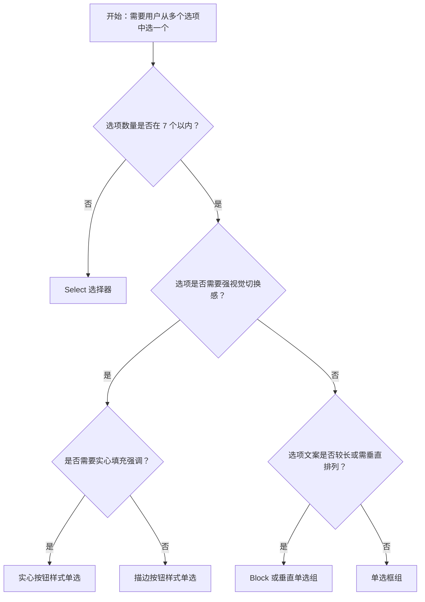

# 1. 简洁易读部份

## 1.0. 组件描述

单选框（Radio）用于在多个互斥备选项中选中唯一一项，所有选项默认可见，便于用户比较后做出选择，因此选项数量不宜过多。与 Select 不同，Radio 强调选项直接展示、无需展开，适用于选项少且需并排对比的场景。

## 1.1. 组件构成

单选框由以下基础要素构成，可按需组合使用：


```react
function App() {
  const { Radio, Typography, Space, Divider } = Infrad;
  const { Text } = Typography;
  return (
    <div style={{ padding: 24 }}>
      <Space size={32} align="start">
        <div>
          <Radio checked style={{ fontSize: 16 }}>已选中选项</Radio>
          <div style={{ marginTop: 16, paddingLeft: 4 }}>
            <div style={{ display: 'flex', gap: 32 }}>
              <div style={{ textAlign: 'center' }}>
                <div style={{ width: 16, height: 16, borderRadius: '50%', border: '2px solid #2673dd', display: 'inline-flex', alignItems: 'center', justifyContent: 'center' }}>
                  <div style={{ width: 8, height: 8, borderRadius: '50%', background: '#2673dd' }} />
                </div>
                <div><Text type="secondary" style={{ fontSize: 12 }}>❶ 选中指示器</Text></div>
              </div>
              <div style={{ textAlign: 'center' }}>
                <Text style={{ fontSize: 14 }}>已选中选项</Text>
                <div><Text type="secondary" style={{ fontSize: 12 }}>❷ 文本标签</Text></div>
              </div>
            </div>
          </div>
        </div>
        <Divider type="vertical" style={{ height: 80 }} />
        <div>
          <Radio.Group defaultValue="a">
            <Radio value="a">选项 A</Radio>
            <Radio value="b">选项 B</Radio>
            <Radio value="c">选项 C</Radio>
          </Radio.Group>
          <div style={{ marginTop: 8 }}>
            <Text type="secondary" style={{ fontSize: 12 }}>❸ 容器（Radio.Group 将一组互斥选项组织在一起）</Text>
          </div>
        </div>
      </Space>
    </div>
  );
}
```

&emsp;&emsp;1. **选中指示器** 圆形或类似形态的控件，用于表示当前是否被选中。

&emsp;&emsp;2. **文本标签** 说明各选项的含义，必须清晰可读，与指示器在视觉上紧密关联。

&emsp;&emsp;3. **容器** 将一组互斥选项组织在一起，保证同一时刻仅有一项被选中。

---

## 1.2. 组件包含哪些不同类型

### 1.2.1 单选框组

&emsp;**是什么**：一组圆形单选框水平或垂直排列，通过点击选择唯一选项


```react
function App() {
  const { Radio } = Infrad;
  return (
    <Radio.Group defaultValue="hangzhou">
      <Radio value="hangzhou">杭州</Radio>
      <Radio value="shanghai">上海</Radio>
      <Radio value="beijing">北京</Radio>
      <Radio value="chengdu">成都</Radio>
    </Radio.Group>
  );
}
```

&emsp;**简单用法**：选项数量建议不超过 7 个；同一 Radio.Group 内选项必须互斥；需明确默认选中项或留空

&emsp;**典型场景**：性别选择、支付方式、图表类型切换（折线图/柱状图/饼图）


```react
function App() {
  const { Radio, Form, Divider } = Infrad;
  return (
    <div style={{ maxWidth: 400 }}>
      <Form layout="horizontal" labelCol={{ span: 6 }} wrapperCol={{ span: 18 }}>
        <Form.Item label="性别" name="gender" initialValue="male">
          <Radio.Group>
            <Radio value="male">男</Radio>
            <Radio value="female">女</Radio>
          </Radio.Group>
        </Form.Item>
      </Form>
      <Divider dashed style={{ margin: '4px 0 12px' }} />
      <Form layout="horizontal" labelCol={{ span: 6 }} wrapperCol={{ span: 18 }}>
        <Form.Item label="图表类型" name="chartType" initialValue="line">
          <Radio.Group>
            <Radio value="line">折线图</Radio>
            <Radio value="bar">柱状图</Radio>
            <Radio value="pie">饼图</Radio>
          </Radio.Group>
        </Form.Item>
      </Form>
    </div>
  );
}
```

&emsp;**替代方案**：若选项超过 7 个，改用 Select；若需多选，改用 Checkbox

### 1.2.2 单选按钮组（描边样式）

&emsp;**是什么**：以按钮形态展示选项，选中项有描边或边框强调，未选中为浅色背景


```react
function App() {
  const { Radio, Typography } = Infrad;
  const { Text } = Typography;
  return (
    <div>
      <Text type="secondary" style={{ fontSize: 12, marginBottom: 8, display: 'block' }}>描边按钮样式（outline）</Text>
      <Radio.Group defaultValue="list" buttonStyle="outline">
        <Radio.Button value="list">列表视图</Radio.Button>
        <Radio.Button value="card">卡片视图</Radio.Button>
        <Radio.Button value="timeline">时间线</Radio.Button>
      </Radio.Group>
    </div>
  );
}
```

&emsp;**简单用法**：适用于选项语义类似「切换模式」的场景；按钮之间视觉上紧密相连；选中态需清晰

&emsp;**典型场景**：视图切换（列表/卡片）、排序方式（最新/最热）、筛选维度（全部/进行中/已完成）


```react
function App() {
  const { Radio, Card, Table, Tag } = Infrad;
  const [status, setStatus] = React.useState('all');
  const columns = [
    { title: '任务名称', dataIndex: 'name', key: 'name' },
    { title: '状态', dataIndex: 'status', key: 'status', render: (s) => s === 'done' ? <Tag color="success">已完成</Tag> : s === 'doing' ? <Tag color="processing">进行中</Tag> : <Tag>待办</Tag> },
    { title: '截止日期', dataIndex: 'deadline', key: 'deadline' },
  ];
  const allData = [
    { key: '1', name: '需求评审', status: 'done', deadline: '2025-03-20' },
    { key: '2', name: 'UI 设计', status: 'doing', deadline: '2025-03-25' },
    { key: '3', name: '前端开发', status: 'todo', deadline: '2025-04-01' },
    { key: '4', name: '测试验收', status: 'todo', deadline: '2025-04-10' },
  ];
  const data = status === 'all' ? allData : allData.filter(d => d.status === status);
  return (
    <Card title="项目任务" size="small">
      <div style={{ marginBottom: 16 }}>
        <Radio.Group value={status} onChange={e => setStatus(e.target.value)} buttonStyle="outline">
          <Radio.Button value="all">全部</Radio.Button>
          <Radio.Button value="doing">进行中</Radio.Button>
          <Radio.Button value="done">已完成</Radio.Button>
        </Radio.Group>
      </div>
      <Table columns={columns} dataSource={data} pagination={false} size="small" />
    </Card>
  );
}
```

&emsp;**替代方案**：若希望选中项更突出，可选用实心按钮样式

### 1.2.3 实心按钮样式单选

&emsp;**是什么**：选中项以实心填充色（如蓝色）强调，未选中为浅色或描边


```react
function App() {
  const { Radio, Typography } = Infrad;
  const { Text } = Typography;
  return (
    <div>
      <Text type="secondary" style={{ fontSize: 12, marginBottom: 8, display: 'block' }}>实心按钮样式（solid）</Text>
      <Radio.Group defaultValue="light" buttonStyle="solid">
        <Radio.Button value="light">亮色主题</Radio.Button>
        <Radio.Button value="dark">暗色主题</Radio.Button>
        <Radio.Button value="auto">跟随系统</Radio.Button>
      </Radio.Group>
    </div>
  );
}
```

&emsp;**简单用法**：适用于需要强视觉区分的切换场景；同一组内选项不宜过多；实色应保持品牌一致性

&emsp;**典型场景**：主题切换（亮色/暗色）、重要筛选（如优先级高/中/低）


```react
function App() {
  const { Radio, Card, List, Tag } = Infrad;
  const [priority, setPriority] = React.useState('all');
  const tasks = [
    { title: '修复生产环境登录异常', priority: 'high' },
    { title: '优化首页加载性能', priority: 'medium' },
    { title: '更新用户协议文案', priority: 'low' },
    { title: '数据库主从切换告警', priority: 'high' },
    { title: '完善单元测试覆盖率', priority: 'medium' },
  ];
  const colorMap = { high: 'red', medium: 'orange', low: 'blue' };
  const labelMap = { high: '高', medium: '中', low: '低' };
  const filtered = priority === 'all' ? tasks : tasks.filter(t => t.priority === priority);
  return (
    <Card title="待办事项" size="small">
      <div style={{ marginBottom: 16 }}>
        <Radio.Group value={priority} onChange={e => setPriority(e.target.value)} buttonStyle="solid">
          <Radio.Button value="all">全部</Radio.Button>
          <Radio.Button value="high">高优先级</Radio.Button>
          <Radio.Button value="medium">中优先级</Radio.Button>
          <Radio.Button value="low">低优先级</Radio.Button>
        </Radio.Group>
      </div>
      <List size="small" dataSource={filtered} renderItem={item => (
        <List.Item><Tag color={colorMap[item.priority]}>{labelMap[item.priority]}</Tag> {item.title}</List.Item>
      )} />
    </Card>
  );
}
```

&emsp;**替代方案**：若希望降低视觉权重，改用描边按钮样式

### 1.2.4 Block 单选组合

&emsp;**是什么**：单选框组宽度撑满父容器，每个选项独占一行或占满可用空间


```react
function App() {
  const { Radio, Flex } = Infrad;
  return (
    <div style={{ maxWidth: 480 }}>
      <Radio.Group defaultValue="hangzhou" style={{ width: '100%' }}>
        <Flex>
          <Radio.Button value="hangzhou" style={{ flex: 1, textAlign: 'center' }}>杭州</Radio.Button>
          <Radio.Button value="shanghai" style={{ flex: 1, textAlign: 'center' }}>上海</Radio.Button>
          <Radio.Button value="beijing" style={{ flex: 1, textAlign: 'center' }}>北京</Radio.Button>
          <Radio.Button value="chengdu" style={{ flex: 1, textAlign: 'center' }}>成都</Radio.Button>
        </Flex>
      </Radio.Group>
    </div>
  );
}
```

&emsp;**简单用法**：适用于选项较多或文案较长的场景；垂直排列更利于阅读；需保证点击区域充足

&emsp;**典型场景**：地区选择（杭州/上海/北京/成都）、收货地址选择、配送方式


```react
function App() {
  const { Radio, Card, Space, Typography } = Infrad;
  const { Text } = Typography;
  const [addr, setAddr] = React.useState('addr1');
  const addresses = [
    { key: 'addr1', name: '张三', phone: '138****1234', detail: '浙江省杭州市西湖区文三路 138 号' },
    { key: 'addr2', name: '李四', phone: '139****5678', detail: '上海市浦东新区张江高科技园区碧波路 690 号' },
    { key: 'addr3', name: '王五', phone: '137****9012', detail: '北京市海淀区中关村大街 1 号' },
  ];
  return (
    <Card title="选择收货地址" size="small" style={{ maxWidth: 520 }}>
      <Radio.Group value={addr} onChange={e => setAddr(e.target.value)} style={{ width: '100%' }}>
        <Space direction="vertical" style={{ width: '100%' }}>
          {addresses.map(a => (
            <Radio key={a.key} value={a.key} style={{ width: '100%', padding: '12px 16px', border: addr === a.key ? '1px solid #2673dd' : '1px solid #d9d9d9', borderRadius: 8, background: addr === a.key ? '#f0f5ff' : '#fff' }}>
              <div><Text strong>{a.name}</Text> <Text type="secondary">{a.phone}</Text></div>
              <Text type="secondary" style={{ fontSize: 13 }}>{a.detail}</Text>
            </Radio>
          ))}
        </Space>
      </Radio.Group>
    </Card>
  );
}
```

&emsp;**替代方案**：若选项少且文案短，使用普通水平或垂直单选即可

### 1.2.5 垂直排列单选框组

&emsp;**是什么**：选项垂直堆叠，适用于选项较多或需与「其他」输入框联动


```react
function App() {
  const { Radio, Space, Input } = Infrad;
  const [value, setValue] = React.useState('email');
  const [otherText, setOtherText] = React.useState('');
  return (
    <Radio.Group value={value} onChange={e => setValue(e.target.value)}>
      <Space direction="vertical">
        <Radio value="email">电子邮件</Radio>
        <Radio value="phone">电话通知</Radio>
        <Radio value="sms">短信提醒</Radio>
        <Radio value="other">
          其他
          {value === 'other' && <Input placeholder="请输入" size="small" style={{ width: 200, marginLeft: 8 }} value={otherText} onChange={e => setOtherText(e.target.value)} />}
        </Radio>
      </Space>
    </Radio.Group>
  );
}
```

&emsp;**简单用法**：选项数量适中时可垂直排列；若最后一项为「其他」，可联动输入框收集自定义内容；间距需保证可点击性

&emsp;**典型场景**：反馈渠道选择、问题类型选择（带其他说明）


```react
function App() {
  const { Radio, Space, Input, Form, Button, Card } = Infrad;
  const [value, setValue] = React.useState(undefined);
  return (
    <Card title="反馈渠道" size="small" style={{ maxWidth: 400 }}>
      <Form layout="vertical">
        <Form.Item label="您是如何得知本产品的？" required>
          <Radio.Group value={value} onChange={e => setValue(e.target.value)}>
            <Space direction="vertical">
              <Radio value="search">搜索引擎</Radio>
              <Radio value="social">社交媒体</Radio>
              <Radio value="friend">朋友推荐</Radio>
              <Radio value="ad">广告投放</Radio>
              <Radio value="other">
                其他
                {value === 'other' && <Input placeholder="请输入具体来源" size="small" style={{ width: 200, marginLeft: 8 }} />}
              </Radio>
            </Space>
          </Radio.Group>
        </Form.Item>
        <Form.Item>
          <Button type="primary" size="small">提交</Button>
        </Form.Item>
      </Form>
    </Card>
  );
}
```

&emsp;**替代方案**：若选项很少，水平排列更紧凑

### 1.2.6 禁用状态

&emsp;**是什么**：单个或整组单选框不可点击，用于权限不足或流程未到该步


```react
function App() {
  const { Radio, Space, Divider, Typography } = Infrad;
  const { Text } = Typography;
  return (
    <Space size={40}>
      <div>
        <Text type="secondary" style={{ fontSize: 12, display: 'block', marginBottom: 8 }}>正常状态</Text>
        <Radio.Group defaultValue="a">
          <Radio value="a">选项 A</Radio>
          <Radio value="b">选项 B</Radio>
        </Radio.Group>
      </div>
      <Divider type="vertical" style={{ height: 48 }} />
      <div>
        <Text type="secondary" style={{ fontSize: 12, display: 'block', marginBottom: 8 }}>禁用状态</Text>
        <Radio.Group defaultValue="a" disabled>
          <Radio value="a">选项 A</Radio>
          <Radio value="b">选项 B</Radio>
        </Radio.Group>
      </div>
    </Space>
  );
}
```

&emsp;**简单用法**：禁用时视觉上明确区分为不可操作；可配合 Tooltip 说明禁用原因；不宜大面积整组禁用

&emsp;**典型场景**：权限受限的表单、已锁定配置的展示、流程中的只读步骤


```react
function App() {
  const { Radio, Space, Tooltip, Form, Card } = Infrad;
  return (
    <Card title="配送方式" size="small" style={{ maxWidth: 400 }}>
      <Form layout="vertical">
        <Form.Item label="请选择配送方式" name="delivery" initialValue="standard">
          <Radio.Group>
            <Space direction="vertical">
              <Radio value="standard">标准配送（3-5 个工作日）</Radio>
              <Radio value="express">加急配送（1-2 个工作日）</Radio>
              <Tooltip title="当前地区暂不支持同城配送">
                <Radio value="sameday" disabled>同城配送（当日达）</Radio>
              </Tooltip>
              <Tooltip title="需开通会员后使用">
                <Radio value="free" disabled>免费配送（仅限会员）</Radio>
              </Tooltip>
            </Space>
          </Radio.Group>
        </Form.Item>
      </Form>
    </Card>
  );
}
```

&emsp;**替代方案**：若整块区域不可操作，可隐藏或折叠该区块

### 1.2.7 配置方式

&emsp;**是什么**：通过 options 配置渲染单选框，而非手写每个 Radio 子节点


```react
function App() {
  const { Radio, Space, Typography } = Infrad;
  const { Text } = Typography;
  const options = [
    { label: '苹果', value: 'apple' },
    { label: '香蕉', value: 'banana' },
    { label: '橙子', value: 'orange' },
    { label: '葡萄', value: 'grape' },
  ];
  return (
    <Space direction="vertical" size={16}>
      <div>
        <Text type="secondary" style={{ fontSize: 12, display: 'block', marginBottom: 8 }}>通过 options 配置</Text>
        <Radio.Group options={options} defaultValue="apple" />
      </div>
      <div>
        <Text type="secondary" style={{ fontSize: 12, display: 'block', marginBottom: 8 }}>通过 options + optionType="button" 配置</Text>
        <Radio.Group options={options} defaultValue="apple" optionType="button" />
      </div>
    </Space>
  );
}
```

&emsp;**简单用法**：选项来源于配置或接口时推荐使用；可配合 optionType 切换为按钮样式；便于维护与扩展

&emsp;**典型场景**：动态选项、多语言选项、与后端配置联动的表单


```react
function App() {
  const { Radio, Button, Space, Card, Tag } = Infrad;
  const { PlusOutlined } = Icons;
  const [options, setOptions] = React.useState([
    { label: '中文', value: 'zh' },
    { label: 'English', value: 'en' },
    { label: '日本語', value: 'ja' },
  ]);
  const [value, setValue] = React.useState('zh');
  const extraOptions = [
    { label: '한국어', value: 'ko' },
    { label: 'Français', value: 'fr' },
    { label: 'Deutsch', value: 'de' },
  ];
  const addOption = () => {
    const available = extraOptions.find(o => !options.find(opt => opt.value === o.value));
    if (available) setOptions([...options, available]);
  };
  return (
    <Card title="语言偏好设置" size="small" style={{ maxWidth: 480 }}>
      <Space direction="vertical" size={12}>
        <Radio.Group options={options} value={value} onChange={e => setValue(e.target.value)} />
        <Button size="small" icon={<PlusOutlined />} onClick={addOption} disabled={options.length >= 6}>添加语言选项</Button>
        <div><Tag color="blue">当前选择：{options.find(o => o.value === value)?.label ?? ''}</Tag></div>
      </Space>
    </Card>
  );
}
```

&emsp;**替代方案**：选项固定且结构简单时，手写 Radio 也可接受

---

## 1.3. 各类型典型场景案例

### 1.3.1 单选框组与选项数量


```react
function App() {
  const { Radio, Space, Typography, Divider, Alert } = Infrad;
  const { Text } = Typography;
  return (
    <Space size={32} align="start" wrap>
      <div style={{ maxWidth: 300 }}>
        <Alert type="success" message="✅ 推荐" showIcon={false} style={{ marginBottom: 12 }} />
        <Text type="secondary" style={{ fontSize: 12, display: 'block', marginBottom: 8 }}>4 个选项，清晰易选</Text>
        <Radio.Group defaultValue="line">
          <Space direction="vertical">
            <Radio value="line">折线图</Radio>
            <Radio value="bar">柱状图</Radio>
            <Radio value="pie">饼图</Radio>
            <Radio value="scatter">散点图</Radio>
          </Space>
        </Radio.Group>
      </div>
      <Divider type="vertical" style={{ height: 200 }} />
      <div style={{ maxWidth: 300 }}>
        <Alert type="error" message="❌ 不推荐" showIcon={false} style={{ marginBottom: 12 }} />
        <Text type="secondary" style={{ fontSize: 12, display: 'block', marginBottom: 8 }}>12 个选项平铺，界面拥挤</Text>
        <Radio.Group defaultValue="line">
          <Radio value="line">折线图</Radio>
          <Radio value="bar">柱状图</Radio>
          <Radio value="pie">饼图</Radio>
          <Radio value="scatter">散点图</Radio>
          <Radio value="area">面积图</Radio>
          <Radio value="radar">雷达图</Radio>
          <Radio value="heatmap">热力图</Radio>
          <Radio value="tree">树状图</Radio>
          <Radio value="sankey">桑基图</Radio>
          <Radio value="funnel">漏斗图</Radio>
          <Radio value="gauge">仪表盘</Radio>
          <Radio value="waterfall">瀑布图</Radio>
        </Radio.Group>
      </div>
    </Space>
  );
}
```

✅ **推荐：** 选项数量控制在 7 个以内，使用单选框组便于比较选择

---

❌ **不推荐：** 选项过多时仍使用单选框，造成界面拥挤、选择困难，应改用 Select

### 1.3.2 按钮样式与语义


```react
function App() {
  const { Radio, Space, Typography, Divider, Alert } = Infrad;
  const { Text } = Typography;
  return (
    <Space size={32} align="start" wrap>
      <div style={{ maxWidth: 320 }}>
        <Alert type="success" message="✅ 推荐" showIcon={false} style={{ marginBottom: 12 }} />
        <Text type="secondary" style={{ fontSize: 12, display: 'block', marginBottom: 8 }}>语义清晰的模式切换</Text>
        <Space direction="vertical" size={12}>
          <Radio.Group defaultValue="list" buttonStyle="outline">
            <Radio.Button value="list">列表视图</Radio.Button>
            <Radio.Button value="card">卡片视图</Radio.Button>
          </Radio.Group>
          <Radio.Group defaultValue="newest" buttonStyle="outline">
            <Radio.Button value="newest">最新</Radio.Button>
            <Radio.Button value="hottest">最热</Radio.Button>
            <Radio.Button value="recommended">推荐</Radio.Button>
          </Radio.Group>
        </Space>
      </div>
      <Divider type="vertical" style={{ height: 140 }} />
      <div style={{ maxWidth: 480 }}>
        <Alert type="error" message="❌ 不推荐" showIcon={false} style={{ marginBottom: 12 }} />
        <Text type="secondary" style={{ fontSize: 12, display: 'block', marginBottom: 8 }}>用按钮样式承载大量无关选项</Text>
        <Radio.Group defaultValue="apple" buttonStyle="outline">
          <Radio.Button value="apple">苹果</Radio.Button>
          <Radio.Button value="banana">香蕉</Radio.Button>
          <Radio.Button value="orange">橙子</Radio.Button>
          <Radio.Button value="grape">葡萄</Radio.Button>
          <Radio.Button value="watermelon">西瓜</Radio.Button>
          <Radio.Button value="mango">芒果</Radio.Button>
          <Radio.Button value="pear">梨</Radio.Button>
          <Radio.Button value="cherry">樱桃</Radio.Button>
        </Radio.Group>
      </div>
    </Space>
  );
}
```

✅ **推荐：** 按钮样式用于「切换模式」「筛选维度」等语义相近的少量选项

---

❌ **不推荐：** 用按钮样式承载大量或语义差异大的选项，导致视觉混乱

### 1.3.3 Block 与垂直排列


```react
function App() {
  const { Radio, Space, Typography, Divider, Alert } = Infrad;
  const { Text } = Typography;
  return (
    <Space size={32} align="start" wrap>
      <div style={{ maxWidth: 360 }}>
        <Alert type="success" message="✅ 推荐" showIcon={false} style={{ marginBottom: 12 }} />
        <Text type="secondary" style={{ fontSize: 12, display: 'block', marginBottom: 8 }}>垂直排列，点击区域充足</Text>
        <Radio.Group defaultValue="standard">
          <Space direction="vertical" size={8}>
            <Radio value="standard" style={{ padding: '8px 0' }}>标准配送（3–5 个工作日，免运费）</Radio>
            <Radio value="express" style={{ padding: '8px 0' }}>加急配送（1–2 个工作日，¥15）</Radio>
            <Radio value="sameday" style={{ padding: '8px 0' }}>同城当日达（仅限本市，¥25）</Radio>
          </Space>
        </Radio.Group>
      </div>
      <Divider type="vertical" style={{ height: 180 }} />
      <div style={{ maxWidth: 480 }}>
        <Alert type="error" message="❌ 不推荐" showIcon={false} style={{ marginBottom: 12 }} />
        <Text type="secondary" style={{ fontSize: 12, display: 'block', marginBottom: 8 }}>长文案水平挤压，点击困难</Text>
        <Radio.Group defaultValue="standard">
          <Radio value="standard">标准配送（3–5 个工作日，免运费）</Radio>
          <Radio value="express">加急配送（1–2 个工作日，¥15）</Radio>
          <Radio value="sameday">同城当日达（仅限本市，¥25）</Radio>
        </Radio.Group>
      </div>
    </Space>
  );
}
```

✅ **推荐：** 选项较多或文案较长时使用 Block 或垂直排列，保证可点击区域与可读性

---

❌ **不推荐：** 长选项仍横向挤压排列，导致文字截断或点击区域过小

### 1.3.4 与 Select 的选择


```react
function App() {
  const { Radio, Select, Space, Typography, Divider, Alert } = Infrad;
  const { Text } = Typography;
  return (
    <Space size={32} align="start" wrap>
      <div style={{ maxWidth: 340 }}>
        <Alert type="success" message="✅ 推荐" showIcon={false} style={{ marginBottom: 12 }} />
        <Space direction="vertical" size={16}>
          <div>
            <Text type="secondary" style={{ fontSize: 12, display: 'block', marginBottom: 8 }}>3 个选项 → 使用 Radio</Text>
            <Radio.Group defaultValue="monthly">
              <Radio value="monthly">月付</Radio>
              <Radio value="quarterly">季付</Radio>
              <Radio value="yearly">年付</Radio>
            </Radio.Group>
          </div>
          <div>
            <Text type="secondary" style={{ fontSize: 12, display: 'block', marginBottom: 8 }}>城市列表 → 使用 Select</Text>
            <Select defaultValue="hangzhou" style={{ width: 200 }} options={[
              { value: 'hangzhou', label: '杭州' },
              { value: 'shanghai', label: '上海' },
              { value: 'beijing', label: '北京' },
              { value: 'guangzhou', label: '广州' },
              { value: 'shenzhen', label: '深圳' },
              { value: 'chengdu', label: '成都' },
              { value: 'wuhan', label: '武汉' },
              { value: 'nanjing', label: '南京' },
            ]} />
          </div>
        </Space>
      </div>
      <Divider type="vertical" style={{ height: 200 }} />
      <div style={{ maxWidth: 340 }}>
        <Alert type="error" message="❌ 不推荐" showIcon={false} style={{ marginBottom: 12 }} />
        <Space direction="vertical" size={16}>
          <div>
            <Text type="secondary" style={{ fontSize: 12, display: 'block', marginBottom: 8 }}>仅 2 项却用 Select，多余操作</Text>
            <Select defaultValue="yes" style={{ width: 200 }} options={[
              { value: 'yes', label: '是' },
              { value: 'no', label: '否' },
            ]} />
          </div>
          <div>
            <Text type="secondary" style={{ fontSize: 12, display: 'block', marginBottom: 8 }}>10+ 项仍用 Radio 平铺</Text>
            <Radio.Group defaultValue="hangzhou">
              <Radio value="hangzhou">杭州</Radio>
              <Radio value="shanghai">上海</Radio>
              <Radio value="beijing">北京</Radio>
              <Radio value="guangzhou">广州</Radio>
              <Radio value="shenzhen">深圳</Radio>
              <Radio value="chengdu">成都</Radio>
              <Radio value="wuhan">武汉</Radio>
              <Radio value="nanjing">南京</Radio>
            </Radio.Group>
          </div>
        </Space>
      </div>
    </Space>
  );
}
```

✅ **推荐：** 选项少（5 项以内）且需并排比较时用 Radio；选项多或空间紧张时用 Select

---

❌ **不推荐：** 仅 2–3 项却用 Select 增加点击步骤；或 10 项以上仍用 Radio 平铺

---

# 2. 选型指南

## 2.1 选择流程




---

# 3. 细致专业部份（交互与排版规则）

为保证单选框的可用性与一致性，请参考以下设计规则：

## 3.1 选项数量与布局

- **数量上限**：单选框组建议选项不超过 7 个；超出时应考虑 Select、分段控件（Segmented）或分组展示。
- **水平与垂直**：选项少、文案短时优先水平排列；选项多或文案长时垂直排列更易扫读。
- **Block 使用**：当每个选项需要较大点击区域或需展示附加信息时，使用 Block 撑满父宽。


```react
function App() {
  const { Radio, Space, Typography, Divider, Flex } = Infrad;
  const { Text } = Typography;
  return (
    <Space direction="vertical" size={24} style={{ width: '100%' }}>
      <div>
        <Text strong style={{ display: 'block', marginBottom: 8 }}>水平排列</Text>
        <Text type="secondary" style={{ fontSize: 12, display: 'block', marginBottom: 8 }}>选项少、文案短时推荐</Text>
        <Radio.Group defaultValue="monthly">
          <Radio value="monthly">月付</Radio>
          <Radio value="quarterly">季付</Radio>
          <Radio value="yearly">年付</Radio>
        </Radio.Group>
      </div>
      <Divider style={{ margin: 0 }} />
      <div>
        <Text strong style={{ display: 'block', marginBottom: 8 }}>垂直排列</Text>
        <Text type="secondary" style={{ fontSize: 12, display: 'block', marginBottom: 8 }}>选项多或文案长时推荐</Text>
        <Radio.Group defaultValue="standard">
          <Space direction="vertical">
            <Radio value="standard">标准配送（3–5 个工作日，免运费）</Radio>
            <Radio value="express">加急配送（1–2 个工作日，运费 ¥15）</Radio>
            <Radio value="sameday">同城当日达（仅限本市，运费 ¥25）</Radio>
          </Space>
        </Radio.Group>
      </div>
      <Divider style={{ margin: 0 }} />
      <div>
        <Text strong style={{ display: 'block', marginBottom: 8 }}>Block 排列</Text>
        <Text type="secondary" style={{ fontSize: 12, display: 'block', marginBottom: 8 }}>选项需撑满宽度时推荐</Text>
        <Radio.Group defaultValue="hangzhou" style={{ width: '100%', maxWidth: 480 }}>
          <Flex>
            <Radio.Button value="hangzhou" style={{ flex: 1, textAlign: 'center' }}>杭州</Radio.Button>
            <Radio.Button value="shanghai" style={{ flex: 1, textAlign: 'center' }}>上海</Radio.Button>
            <Radio.Button value="beijing" style={{ flex: 1, textAlign: 'center' }}>北京</Radio.Button>
            <Radio.Button value="chengdu" style={{ flex: 1, textAlign: 'center' }}>成都</Radio.Button>
          </Flex>
        </Radio.Group>
      </div>
    </Space>
  );
}
```

## 3.2 与表单的配合

- **必填与默认值**：若为必填项，需设置默认值或明确引导用户选择；避免提交时才发现未选。
- **与其它控件联动**：「其他」选项可联动输入框，需在交互上明确二者关系。
- **校验反馈**：校验失败时，错误提示应靠近单选框组，不遮挡选项本身。


```react
function App() {
  const { Radio, Form, Button, Card, Space } = Infrad;
  return (
    <Card title="订单确认" size="small" style={{ maxWidth: 400 }}>
      <Form layout="vertical" onFinishFailed={({ errorFields }) => console.log(errorFields)}>
        <Form.Item label="支付方式" name="payment" rules={[{ required: true, message: '请选择支付方式' }]}>
          <Radio.Group>
            <Space direction="vertical">
              <Radio value="alipay">支付宝</Radio>
              <Radio value="wechat">微信支付</Radio>
              <Radio value="card">银行卡</Radio>
            </Space>
          </Radio.Group>
        </Form.Item>
        <Form.Item>
          <Button type="primary" htmlType="submit" size="small">提交订单</Button>
        </Form.Item>
      </Form>
    </Card>
  );
}
```

## 3.3 按钮样式的视觉层级

- **描边样式**：适用于需弱化视觉权重的切换场景，选中态通过描边或背景区分。
- **实心样式**：适用于需强调当前选中状态的场景，实色填充应保持与主色一致。
- **一致性**：同一页面内，同类切换场景应统一使用描边或实心，避免混用。


```react
function App() {
  const { Radio, Space, Typography, Divider } = Infrad;
  const { Text } = Typography;
  return (
    <Space size={40} align="start" wrap>
      <div>
        <Text strong style={{ display: 'block', marginBottom: 8 }}>描边样式（outline）</Text>
        <Text type="secondary" style={{ fontSize: 12, display: 'block', marginBottom: 12 }}>视觉权重较低，适合辅助性切换</Text>
        <Radio.Group defaultValue="newest" buttonStyle="outline">
          <Radio.Button value="newest">最新</Radio.Button>
          <Radio.Button value="hottest">最热</Radio.Button>
          <Radio.Button value="recommended">推荐</Radio.Button>
        </Radio.Group>
      </div>
      <Divider type="vertical" style={{ height: 80 }} />
      <div>
        <Text strong style={{ display: 'block', marginBottom: 8 }}>实心样式（solid）</Text>
        <Text type="secondary" style={{ fontSize: 12, display: 'block', marginBottom: 12 }}>视觉权重较高，适合强调当前选中</Text>
        <Radio.Group defaultValue="newest" buttonStyle="solid">
          <Radio.Button value="newest">最新</Radio.Button>
          <Radio.Button value="hottest">最热</Radio.Button>
          <Radio.Button value="recommended">推荐</Radio.Button>
        </Radio.Group>
      </div>
    </Space>
  );
}
```

## 3.4 顺序与分组

- **顺序**：选项顺序应符合业务逻辑或用户习惯（如按频率、按字母、按流程）。
- **分组**：若选项可逻辑分组，可用标题或分割线区分，但同一 Radio.Group 内仍保持互斥。
- **「其他」位置**：若存在「其他」选项，通常置于最后，并联动自定义输入。

## 3.5 状态与交互反馈

- **默认**：未选中项清晰可点击，选中项明确标识。
- **悬停**：悬停时应有可点击暗示（如背景或描边变化）。
- **禁用**：禁用时视觉降级（如灰色），且不可点击；可配合 Tooltip 说明原因。
- **焦点**：键盘导航时焦点可见，支持方向键在同一组内切换选项。

## 3.6 无障碍与键盘

- **name 属性**：Radio.Group 应设置 name，使浏览器将一组 Radio 识别为同一组，支持方向键在同一组内切换。
- **标签关联**：每个选项的文本需与对应的 input 正确关联，便于读屏器识别。
- **焦点顺序**：Tab 进入组后，焦点应先落在当前选中项或第一项，再通过方向键切换。


```react
function App() {
  const { Radio, Typography, Space, Tag, Card } = Infrad;
  const { Text } = Typography;
  return (
    <Card size="small" style={{ maxWidth: 520 }}>
      <Space direction="vertical" size={16} style={{ width: '100%' }}>
        <div>
          <Text strong>键盘导航演示</Text>
          <Text type="secondary" style={{ fontSize: 13, display: 'block', marginTop: 4 }}>点击下方单选框组，然后使用键盘操作：</Text>
        </div>
        <Space wrap>
          <Tag color="blue">Tab</Tag><Text type="secondary">进入/离开单选组</Text>
          <Tag color="blue">← →</Tag><Text type="secondary">切换选项</Text>
          <Tag color="blue">↑ ↓</Tag><Text type="secondary">切换选项</Text>
        </Space>
        <Radio.Group defaultValue="apple" name="keyboard-demo">
          <Radio value="apple">苹果</Radio>
          <Radio value="banana">香蕉</Radio>
          <Radio value="orange">橙子</Radio>
          <Radio value="grape">葡萄</Radio>
        </Radio.Group>
        <Text type="secondary" style={{ fontSize: 12 }}>提示：Radio.Group 设置 name 属性后，浏览器会将同组选项识别为一个焦点组，支持方向键在组内切换</Text>
      </Space>
    </Card>
  );
}
```

---

## 4.0. 常见问题

### 1. Radio 和 Select 怎么选？

- **Radio**：选项少（建议 5–7 个以内），且希望**全部可见、便于比较**时使用。如性别、支付方式、图表类型。
- **Select**：选项多、或空间有限、需要**收起选项**时使用。如城市选择、长列表。

### 2. 单选按钮和普通单选框的区别？

- **普通单选框**：圆形指示器 + 文本，占用空间小，适合表单内紧凑排列。
- **单选按钮**：按钮形态，视觉权重更高，适合**模式切换、筛选维度**等需要强调「当前选中项」的场景。描边样式较克制，实心样式更醒目。

### 3. 何时使用 Block 单选组合？

- 选项较多或文案较长，需要**每项独占一行**以提升可读性。
- 需要**更大的点击区域**，如移动端或触屏场景。
- 每个选项需要**展示附加信息**（如说明文字、图标），需要更多空间时。

