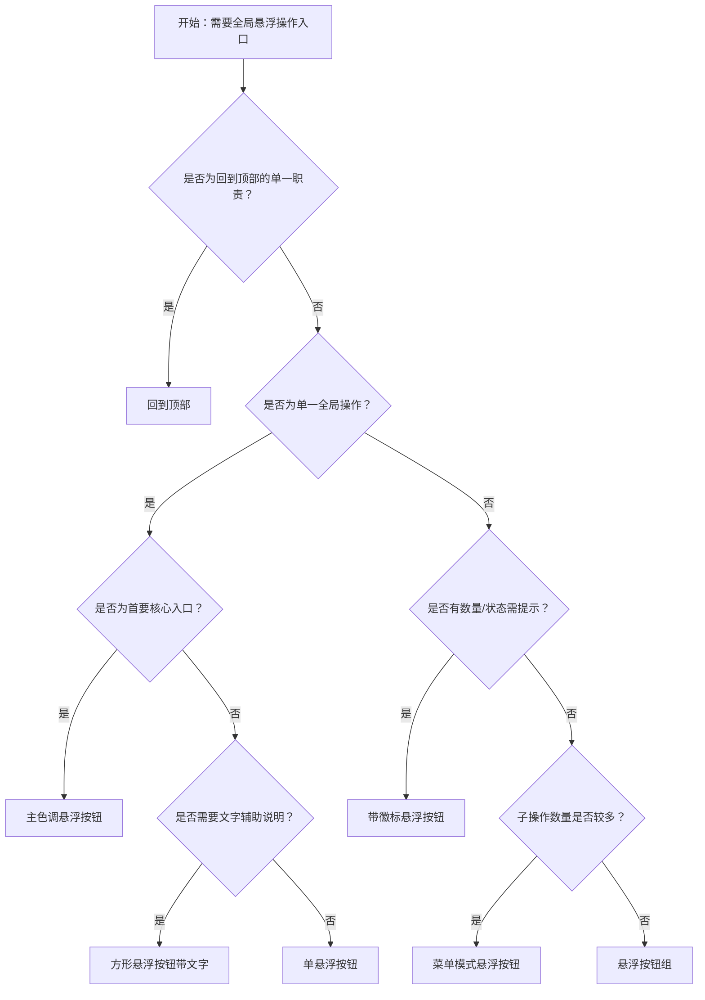

# 1. 简洁易读部份

## 1.0. 组件描述

悬浮按钮用于在页面上提供固定的全局操作入口，无论用户浏览到何处都可以看见并快速触达。

## 1.1. 组件构成

悬浮按钮由以下基础要素构成，可按需组合使用：

<!-- 附图占位：建议附上一张示例图，展示悬浮按钮的基础要素（容器、图标、可选文字描述）的构成关系，标注各要素名称与位置 -->
<!-- [▶ 在线演示](https://infrad.shopee.io/playground/?agent_code_id=335) -->
```react
function App() {
  const { FloatButton, Flex, Typography } = Infrad;
  const { MessageOutlined } = Icons;
  return (
    <Flex align="flex-start" gap={20} wrap="wrap">
      <div style={{ position: "relative", width: 220, height: 160, border: "1px solid #f0f0f0", borderRadius: 8 }}>
        <Typography.Text type="secondary" style={{ position: "absolute", top: 8, left: 8, fontSize: 11 }}>① 容器 · 视口内固定悬浮</Typography.Text>
        <FloatButton icon={<MessageOutlined />} shape="square" description="反馈" style={{ position: "absolute", right: 16, bottom: 16 }} />
      </div>
      <Flex vertical gap={8} style={{ maxWidth: 190 }}>
        <Typography.Text strong style={{ fontSize: 12 }}>② 图标（语义核心）</Typography.Text>
        <div style={{ position: "relative", width: 48, height: 48 }}>
          <FloatButton icon={<MessageOutlined />} style={{ position: "absolute", right: 0, bottom: 0 }} />
        </div>
        <Typography.Text type="secondary" style={{ fontSize: 11 }}>③ 方形可加双字 description</Typography.Text>
      </Flex>
    </Flex>
  );
}
```

&emsp;&emsp;1. **容器** 定义按钮的点击区域与整体形态，固定悬浮于视口某一位置，用于承载图标与可选文字。

&emsp;&emsp;2. **图标** 表达操作语义，为悬浮按钮的核心要素，必须清晰可识别。

&emsp;&emsp;3. **文字描述（可选）** 用于补充说明操作含义，仅在方形按钮中支持，需精简。

---

## 1.2. 组件包含哪些不同类型

### 1.2.1 单悬浮按钮（默认）

&emsp;**是什么**：单个悬浮于页面上方的圆形按钮，承载单一全局操作

<!-- 附图占位：建议附上一张示例图，展示单悬浮按钮（圆形、右下角固定）的视觉形态，体现其作为全局入口的悬浮特性 -->
<!-- [▶ 在线演示](https://infrad.shopee.io/playground/?agent_code_id=336) -->
```react
function App() {
  const { FloatButton, Typography } = Infrad;
  const { MessageOutlined } = Icons;
  return (
    <div style={{ position: "relative", height: 160, border: "1px solid #f0f0f0", borderRadius: 8 }}>
      <Typography.Text type="secondary" style={{ position: "absolute", top: 8, left: 8, fontSize: 11 }}>圆形单按钮 · 右下角全局入口</Typography.Text>
      <FloatButton icon={<MessageOutlined />} tooltip="反馈" style={{ position: "absolute", right: 20, bottom: 20 }} />
    </div>
  );
}
```

&emsp;**简单用法**：必须用于网站上的全局功能；无论用户滚动到何处都需可见；同一视口内同一区域不宜出现多个独立悬浮按钮

&emsp;**典型场景**：反馈入口、在线客服、快捷帮助、提交建议

&emsp;**替代方案**：若需收纳多个操作，改用悬浮按钮组或菜单模式

### 1.2.2 主色调悬浮按钮

&emsp;**是什么**：采用主色填充的悬浮按钮，用于强调当前页面的首要全局操作

<!-- 附图占位：建议附上一张示例图，展示主色调悬浮按钮（实心填充、品牌色）与默认悬浮按钮的视觉对比，体现层级差异 -->
<!-- [▶ 在线演示](https://infrad.shopee.io/playground/?agent_code_id=337) -->
```react
function App() {
  const { FloatButton, Flex, Typography } = Infrad;
  const { MessageOutlined, AimOutlined } = Icons;
  return (
    <Flex gap={24} align="center" wrap="wrap" style={{ minHeight: 120 }}>
      <div style={{ position: "relative", width: 108, height: 108, border: "1px dashed #d9d9d9", borderRadius: 8 }}>
        <Typography.Text type="secondary" style={{ position: "absolute", top: 6, left: 6, fontSize: 10 }}>默认弱强调</Typography.Text>
        <FloatButton icon={<MessageOutlined />} style={{ position: "absolute", right: 12, bottom: 12 }} />
      </div>
      <div style={{ position: "relative", width: 108, height: 108, border: "1px dashed #d9d9d9", borderRadius: 8 }}>
        <Typography.Text type="secondary" style={{ position: "absolute", top: 6, left: 6, fontSize: 10 }}>主色首要入口</Typography.Text>
        <FloatButton type="primary" icon={<AimOutlined />} style={{ position: "absolute", right: 12, bottom: 12 }} />
      </div>
    </Flex>
  );
}
```

&emsp;**简单用法**：必须用于页面唯一的、最重要的全局入口；不可与多个同等强调的悬浮按钮并存；视觉上需明显区别于默认类型

&emsp;**典型场景**：主 CTA（如「立即咨询」）、核心业务入口、付费转化按钮

&emsp;**替代方案**：若操作非首要目标，改用默认悬浮按钮

### 1.2.3 方形悬浮按钮（带文字）

&emsp;**是什么**：采用方形形态的悬浮按钮，可携带精简文字描述以增强识别

<!-- 附图占位：建议附上一张示例图，展示方形悬浮按钮（含图标与双字描述如「反馈」）的视觉形态，体现方形+文字的紧凑组合 -->
<!-- [▶ 在线演示](https://infrad.shopee.io/playground/?agent_code_id=338) -->
```react
function App() {
  const { FloatButton, Typography } = Infrad;
  const { MessageOutlined } = Icons;
  return (
    <div style={{ position: "relative", height: 128, border: "1px solid #f0f0f0", borderRadius: 8 }}>
      <Typography.Text type="secondary" style={{ position: "absolute", top: 8, left: 8, fontSize: 11 }}>方形 · 图标 + 双字文案</Typography.Text>
      <FloatButton icon={<MessageOutlined />} shape="square" description="反馈" style={{ position: "absolute", right: 20, bottom: 20 }} />
    </div>
  );
}
```

&emsp;**简单用法**：必须用于需要文字辅助说明语义的场景；文字必须精简，推荐双字；仅方形支持文字内容

&emsp;**典型场景**：反馈、客服、帮助、回到顶部

&emsp;**替代方案**：若语义通过图标已可识别，改用圆形悬浮按钮

### 1.2.4 悬浮按钮组

&emsp;**是什么**：将多个同类悬浮按钮组合在一起，自上而下或自侧展开，无需二次点击即可看到全部选项

<!-- 附图占位：建议附上一张示例图，展示悬浮按钮组展开后的形态（触发按钮 + 多个子按钮垂直排列），体现一次性展示多个操作的布局 -->
<!-- [▶ 在线演示](https://infrad.shopee.io/playground/?agent_code_id=339) -->
```react
function App() {
  const { FloatButton, Typography } = Infrad;
  const { MessageOutlined, CustomerServiceOutlined, QuestionCircleOutlined } = Icons;
  return (
    <div style={{ position: "relative", height: 220, border: "1px solid #f0f0f0", borderRadius: 8 }}>
      <Typography.Text type="secondary" style={{ position: "absolute", top: 8, left: 8, fontSize: 11 }}>按钮组展开 · 主钮 + 子钮纵向排列</Typography.Text>
      <FloatButton.Group shape="circle" open style={{ position: "absolute", right: 20, bottom: 20 }}>
        <FloatButton icon={<MessageOutlined />} tooltip="反馈" />
        <FloatButton icon={<CustomerServiceOutlined />} tooltip="客服" />
        <FloatButton icon={<QuestionCircleOutlined />} tooltip="帮助" />
      </FloatButton.Group>
    </div>
  );
}
```

&emsp;**简单用法**：必须用于多个同等重要或平级的全局操作；子按钮数量不宜超过 5 个；展开方向需与页面留白匹配

&emsp;**典型场景**：反馈 + 帮助 + 客服、多种快捷入口并列

&emsp;**替代方案**：若子项过多或需收纳，改用菜单模式悬浮按钮

### 1.2.5 菜单模式悬浮按钮

&emsp;**是什么**：点击或悬停后展开菜单，将多个操作收纳到单一触发入口中

<!-- 附图占位：建议附上一张示例图，展示菜单模式悬浮按钮展开后的形态（触发按钮 + 下拉/上拉菜单列表），体现收纳与展开的交互结构 -->
<!-- [▶ 在线演示](https://infrad.shopee.io/playground/?agent_code_id=340) -->
```react
function App() {
  const { FloatButton, Typography } = Infrad;
  const { EllipsisOutlined, ExportOutlined, ShareAltOutlined, StarOutlined } = Icons;
  return (
    <div style={{ position: "relative", height: 240, border: "1px solid #f0f0f0", borderRadius: 8 }}>
      <Typography.Text type="secondary" style={{ position: "absolute", top: 8, left: 8, fontSize: 11 }}>菜单模式 · 主触发 + 收纳列表</Typography.Text>
      <FloatButton.Group trigger="click" open icon={<EllipsisOutlined />} type="primary" style={{ position: "absolute", right: 20, bottom: 20 }}>
        <FloatButton icon={<ExportOutlined />} tooltip="导出" />
        <FloatButton icon={<ShareAltOutlined />} tooltip="分享" />
        <FloatButton icon={<StarOutlined />} tooltip="收藏" />
      </FloatButton.Group>
    </div>
  );
}
```

&emsp;**简单用法**：必须用于操作较多、需收纳以节省空间的场景；支持点击或悬停触发；主触发按钮必须明确表达「更多」或核心动作

&emsp;**典型场景**：多种反馈入口、多项快捷操作、导出/分享/收藏等动作集合

&emsp;**替代方案**：若操作数量少且重要性相近，改用悬浮按钮组

### 1.2.6 回到顶部

&emsp;**是什么**：专用于长页面滚动后，一键返回页面顶部的悬浮按钮

<!-- 附图占位：建议附上一张示例图，展示回到顶部按钮（通常为向上箭头图标）的视觉形态，体现其单一职责 -->
<!-- [▶ 在线演示](https://infrad.shopee.io/playground/?agent_code_id=341) -->
```react
function App() {
  const { FloatButton, Typography } = Infrad;
  const uid = React.useId().replace(/:/g, "");
  const boxId = "fb-bt-" + uid;
  return (
    <div id={boxId} style={{ position: "relative", height: 200, overflow: "auto", border: "1px solid #f0f0f0", borderRadius: 8 }}>
      <div style={{ height: 480, padding: 12, fontSize: 12, color: "#999" }}>
        <Typography.Text type="secondary">长内容区内滚动后出现 BackTop（向上箭头）</Typography.Text>
      </div>
      <FloatButton.BackTop visibilityHeight={80} target={() => document.getElementById(boxId)} style={{ position: "absolute", right: 16, bottom: 16 }} />
    </div>
  );
}
```

&emsp;**简单用法**：必须用于长内容页面的滚动场景；需在用户滚动一定高度后才出现；点击后平滑滚动至顶部

&emsp;**典型场景**：文章页、列表页、详情页、文档页

&emsp;**替代方案**：若页面内容较短无需滚动，不必使用回到顶部

### 1.2.7 带徽标悬浮按钮

&emsp;**是什么**：在悬浮按钮右上角附带数字徽标，提示待处理数量或新消息

<!-- 附图占位：建议附上一张示例图，展示带徽标悬浮按钮（右上角红色圆点或数字）的视觉形态，体现数量/状态提示 -->
<!-- [▶ 在线演示](https://infrad.shopee.io/playground/?agent_code_id=342) -->
```react
function App() {
  const { FloatButton, Badge, Flex, Typography } = Infrad;
  const { MessageOutlined, BellOutlined, MailOutlined } = Icons;
  return (
    <Flex vertical gap={8}>
      <Typography.Text type="secondary" style={{ fontSize: 11 }}>数字徽标 / 红点 · 提示待处理或新消息</Typography.Text>
      <Flex gap={24} wrap="wrap" style={{ minHeight: 88 }}>
        <div style={{ position: "relative", width: 52, height: 52 }}>
          <Badge count={3}><FloatButton icon={<MessageOutlined />} style={{ position: "absolute", right: 0, bottom: 0 }} /></Badge>
        </div>
        <div style={{ position: "relative", width: 52, height: 52 }}>
          <Badge count={12}><FloatButton type="primary" icon={<BellOutlined />} style={{ position: "absolute", right: 0, bottom: 0 }} /></Badge>
        </div>
        <div style={{ position: "relative", width: 52, height: 52 }}>
          <Badge dot><FloatButton icon={<MailOutlined />} style={{ position: "absolute", right: 0, bottom: 0 }} /></Badge>
        </div>
      </Flex>
    </Flex>
  );
}
```

&emsp;**简单用法**：必须用于有数量或状态提示需求的入口；徽标数字需与业务含义一致；不可滥用，以免干扰用户

&emsp;**典型场景**：消息通知、待处理数量、客服未读数

&emsp;**替代方案**：若无需数量提示，改用普通悬浮按钮

---

## 1.3. 各类型典型场景案例

### 1.3.1 单悬浮按钮

<!-- 附图占位：建议附上一张对比图，左侧展示单一全局操作使用单悬浮按钮（符合规范），右侧展示同一视口内多个独立悬浮按钮并列（违反规范） -->
<!-- [▶ 在线演示](https://infrad.shopee.io/playground/?agent_code_id=343) -->
```react
function App() {
  const { FloatButton, Flex, Typography, Tag } = Infrad;
  const { MessageOutlined, QuestionCircleOutlined } = Icons;
  return (
    <Flex gap={16} wrap="wrap">
      <div style={{ position: "relative", flex: "1 1 200px", height: 120, border: "1px solid #b7eb8f", borderRadius: 8 }}>
        <Tag color="success" style={{ position: "absolute", top: 6, left: 6 }}>推荐</Tag>
        <Typography.Text type="secondary" style={{ position: "absolute", bottom: 8, left: 8, fontSize: 10 }}>单一全局入口</Typography.Text>
        <FloatButton icon={<MessageOutlined />} style={{ position: "absolute", right: 12, bottom: 12 }} />
      </div>
      <div style={{ position: "relative", flex: "1 1 200px", height: 120, border: "1px solid #ffccc7", borderRadius: 8 }}>
        <Tag color="error" style={{ position: "absolute", top: 6, left: 6 }}>避免</Tag>
        <FloatButton icon={<MessageOutlined />} style={{ position: "absolute", right: 12, bottom: 12 }} />
        <FloatButton icon={<QuestionCircleOutlined />} style={{ position: "absolute", right: 68, bottom: 12 }} />
      </div>
    </Flex>
  );
}
```

✅ **推荐：** 单一全局入口使用单悬浮按钮，保持界面简洁

<hr>

❌ **不推荐：** 同一视口内出现多个独立悬浮按钮，造成视觉干扰

### 1.3.2 主色调与默认

<!-- 附图占位：建议附上一张对比图，左侧展示首要操作用主色调、次要用默认（符合规范），右侧展示多个主色调悬浮按钮并列（违反规范） -->
<!-- [▶ 在线演示](https://infrad.shopee.io/playground/?agent_code_id=344) -->
```react
function App() {
  const { FloatButton, Flex, Tag, Typography } = Infrad;
  const { QuestionCircleOutlined, AimOutlined } = Icons;
  return (
    <Flex gap={16} wrap="wrap">
      <div style={{ position: "relative", flex: "1 1 200px", height: 130, border: "1px solid #b7eb8f", borderRadius: 8 }}>
        <Tag color="success" style={{ position: "absolute", top: 6, left: 6 }}>推荐</Tag>
        <Typography.Text type="secondary" style={{ position: "absolute", top: 28, left: 6, fontSize: 10 }}>仅一个主色强调</Typography.Text>
        <FloatButton.Group shape="circle" open style={{ position: "absolute", right: 12, bottom: 12 }}>
          <FloatButton icon={<QuestionCircleOutlined />} />
          <FloatButton type="primary" icon={<AimOutlined />} />
        </FloatButton.Group>
      </div>
      <div style={{ position: "relative", flex: "1 1 200px", height: 130, border: "1px solid #ffccc7", borderRadius: 8 }}>
        <Tag color="error" style={{ position: "absolute", top: 6, left: 6 }}>避免</Tag>
        <FloatButton.Group shape="circle" open style={{ position: "absolute", right: 12, bottom: 12 }}>
          <FloatButton type="primary" icon={<QuestionCircleOutlined />} />
          <FloatButton type="primary" icon={<AimOutlined />} />
        </FloatButton.Group>
      </div>
    </Flex>
  );
}
```

✅ **推荐：** 首要全局操作使用主色调悬浮按钮，次要操作使用默认

<hr>

❌ **不推荐：** 多个同等强调的主色调悬浮按钮并存

### 1.3.3 悬浮按钮组与菜单模式

<!-- 附图占位：建议附上一张对比图，左侧展示 3–5 个平级操作用悬浮按钮组（符合规范），右侧展示 6 个以上操作平铺或收纳到菜单模式（符合规范） -->
<!-- [▶ 在线演示](https://infrad.shopee.io/playground/?agent_code_id=345) -->
```react
function App() {
  const { FloatButton, Flex, Typography, Tag } = Infrad;
  const { MessageOutlined, CustomerServiceOutlined, QuestionCircleOutlined, EllipsisOutlined, FileTextOutlined } = Icons;
  return (
    <Flex gap={16} wrap="wrap" align="flex-start">
      <div style={{ position: "relative", width: 200, height: 200, border: "1px solid #b7eb8f", borderRadius: 8 }}>
        <Tag color="success" style={{ position: "absolute", top: 6, left: 6 }}>3 项直展</Tag>
        <FloatButton.Group shape="circle" open style={{ position: "absolute", right: 12, bottom: 12 }}>
          <FloatButton icon={<MessageOutlined />} />
          <FloatButton icon={<CustomerServiceOutlined />} />
          <FloatButton icon={<QuestionCircleOutlined />} />
        </FloatButton.Group>
      </div>
      <div style={{ position: "relative", width: 200, height: 200, border: "1px solid #eee", borderRadius: 8 }}>
        <Typography.Text type="secondary" style={{ position: "absolute", top: 6, left: 6, fontSize: 11 }}>多项收纳 · 菜单模式</Typography.Text>
        <FloatButton.Group trigger="click" open icon={<EllipsisOutlined />} type="primary" style={{ position: "absolute", right: 12, bottom: 12 }}>
          <FloatButton icon={<MessageOutlined />} />
          <FloatButton icon={<FileTextOutlined />} />
          <FloatButton icon={<CustomerServiceOutlined />} />
          <FloatButton icon={<QuestionCircleOutlined />} />
        </FloatButton.Group>
      </div>
    </Flex>
  );
}
```

✅ **推荐：** 操作数量少用悬浮按钮组直接展示，操作多用菜单模式收纳

<hr>

❌ **不推荐：** 大量操作平铺在悬浮按钮组中，造成选择困难

### 1.3.4 回到顶部

<!-- 附图占位：建议附上一张对比图，左侧展示长页面滚动后出现回到顶部（符合规范），右侧展示短页面也放置回到顶部（违反规范） -->
<!-- [▶ 在线演示](https://infrad.shopee.io/playground/?agent_code_id=346) -->
```react
function App() {
  const { FloatButton, Flex, Typography, Tag } = Infrad;
  const { VerticalAlignTopOutlined } = Icons;
  const uid = React.useId().replace(/:/g, "");
  const longId = "fb-long-" + uid;
  return (
    <Flex gap={16} wrap="wrap">
      <div id={longId} style={{ position: "relative", flex: "1 1 180px", height: 160, border: "1px solid #b7eb8f", borderRadius: 8, overflow: "auto" }}>
        <Tag color="success" style={{ position: "absolute", top: 6, left: 6, zIndex: 1 }}>长页</Tag>
        <div style={{ height: 400 }} />
        <FloatButton.BackTop visibilityHeight={30} target={() => document.getElementById(longId)} style={{ position: "absolute", right: 12, bottom: 12 }} />
      </div>
      <div style={{ position: "relative", flex: "1 1 180px", height: 100, border: "1px solid #ffccc7", borderRadius: 8 }}>
        <Tag color="error" style={{ position: "absolute", top: 6, left: 6 }}>短页</Tag>
        <Typography.Text type="secondary" style={{ padding: 32, display: "block", fontSize: 11 }}>内容不足一屏仍放置顶</Typography.Text>
        <FloatButton icon={<VerticalAlignTopOutlined />} style={{ position: "absolute", right: 12, bottom: 12 }} />
      </div>
    </Flex>
  );
}
```

✅ **推荐：** 长内容页面、需滚动浏览时使用回到顶部

<hr>

❌ **不推荐：** 内容不足以产生滚动的页面放置回到顶部

---

# 2. 选型指南

## 2.1 选择流程




---

# 3. 细致专业部份（交互与排版规则）

## 3.1 多操作的展示与折叠策略

当悬浮区域需要承载多个全局操作时，需按以下逻辑决定展示与收纳：

* **直接展示**：3–5 个同等重要、使用频率高的操作，使用悬浮按钮组自上而下或自侧展开。
* **收纳展示**：超过 5 个操作，或操作重要性差异明显、需要「更多」语义时，使用菜单模式悬浮按钮，通过点击或悬停展开。
* **单一优先**：若只有一个核心全局入口，使用单悬浮按钮；避免为凑齐多个而强行增加入口。

<!-- 附图占位：建议附上一张场景图，展示悬浮按钮组与菜单模式的对比布局，体现多操作的展示与收纳策略 -->
<!-- [▶ 在线演示](https://infrad.shopee.io/playground/?agent_code_id=347) -->
```react
function App() {
  const { FloatButton, Flex, Typography } = Infrad;
  const { MessageOutlined, CustomerServiceOutlined, EllipsisOutlined, ExportOutlined } = Icons;
  return (
    <Flex gap={24} wrap="wrap" align="flex-start">
      <div>
        <Typography.Text type="secondary" style={{ fontSize: 11, display: "block", marginBottom: 8 }}>按钮组 · 平铺展开（少而精）</Typography.Text>
        <div style={{ position: "relative", height: 180, width: 160, border: "1px dashed #d9d9d9", borderRadius: 8 }}>
          <FloatButton.Group shape="circle" open style={{ position: "absolute", right: 16, bottom: 16 }}>
            <FloatButton icon={<MessageOutlined />} />
            <FloatButton icon={<CustomerServiceOutlined />} />
          </FloatButton.Group>
        </div>
      </div>
      <div>
        <Typography.Text type="secondary" style={{ fontSize: 11, display: "block", marginBottom: 8 }}>菜单模式 · 收纳更多操作</Typography.Text>
        <div style={{ position: "relative", height: 180, width: 160, border: "1px dashed #d9d9d9", borderRadius: 8 }}>
          <FloatButton.Group trigger="click" open icon={<EllipsisOutlined />} style={{ position: "absolute", right: 16, bottom: 16 }}>
            <FloatButton icon={<ExportOutlined />} tooltip="导出" />
            <FloatButton icon={<MessageOutlined />} tooltip="反馈" />
          </FloatButton.Group>
        </div>
      </div>
    </Flex>
  );
}
```

## 3.2 危险操作（删除/清空/停用）

悬浮按钮通常不承载危险操作；若业务强需求在悬浮入口中提供删除、停用等操作：

* **收纳**：危险操作必须收纳在菜单模式或悬浮按钮组中，不可作为主触发按钮。
* **二次确认**：点击后必须通过弹窗进行二次确认，再执行。
* **视觉隔离**：在展开列表中，危险项需通过红色或弱化样式与常规项区分。

<!-- 附图占位：建议附上一张场景图，展示悬浮按钮菜单中危险操作（如「清空」）收纳在列表末尾、配合二次确认的布局 -->
<!-- [▶ 在线演示](https://infrad.shopee.io/playground/?agent_code_id=348) -->
```react
function App() {
  const { FloatButton, Modal, Flex, Typography } = Infrad;
  const { EllipsisOutlined, DeleteOutlined, FileTextOutlined } = Icons;
  const [open, setOpen] = React.useState(false);
  return (
    <Flex vertical gap={8} style={{ maxWidth: 320 }}>
      <Typography.Text type="secondary" style={{ fontSize: 11 }}>危险项置底 · 点击后弹窗二次确认</Typography.Text>
      <div style={{ position: "relative", height: 200, border: "1px solid #f0f0f0", borderRadius: 8 }}>
        <FloatButton.Group trigger="click" open icon={<EllipsisOutlined />} type="primary" style={{ position: "absolute", right: 16, bottom: 16 }}>
          <FloatButton icon={<FileTextOutlined />} tooltip="草稿" />
          <FloatButton icon={<DeleteOutlined />} tooltip="清空" type="primary" danger onClick={() => setOpen(true)} />
        </FloatButton.Group>
      </div>
      <Modal open={open} title="确认清空？" onOk={() => setOpen(false)} onCancel={() => setOpen(false)} okText="确认" okButtonProps={{ danger: true }}>
        <Typography.Text>此操作不可恢复</Typography.Text>
      </Modal>
    </Flex>
  );
}
```

## 3.3 摆放位置（按页面场景划分）

悬浮按钮的固定位置需与用户视线及操作习惯匹配：

* **默认右下角**：适用于多数桌面端页面，符合「从右到左」的视线落点，不遮挡主体内容。
* **自定义方向**：若右下角已被占用（如聊天窗口、广告位），可调整至左下、左上或右上；需保证不与核心内容重叠。
* **移动端**：需考虑拇指可触达区域，通常仍为右下角或底部居中偏右。
* **与内容边距**：悬浮按钮与视口边缘需保持固定间距，避免贴边或遮挡滚动条。

<!-- 附图占位：建议附上一张场景图，展示桌面端右下角、移动端底部等不同场景下的悬浮按钮摆放位置，体现位置规范 -->
<!-- [▶ 在线演示](https://infrad.shopee.io/playground/?agent_code_id=349) -->
```react
function App() {
  const { FloatButton, Flex, Typography } = Infrad;
  const { MessageOutlined } = Icons;
  return (
    <Flex gap={24} wrap="wrap">
      <div style={{ position: "relative", width: 200, height: 120, border: "1px solid #f0f0f0", borderRadius: 8 }}>
        <Typography.Text type="secondary" style={{ position: "absolute", top: 6, left: 6, fontSize: 10 }}>桌面 · 右下默认</Typography.Text>
        <FloatButton icon={<MessageOutlined />} style={{ position: "absolute", right: 16, bottom: 16 }} />
      </div>
      <div style={{ position: "relative", width: 200, height: 120, border: "1px solid #f0f0f0", borderRadius: 8 }}>
        <Typography.Text type="secondary" style={{ position: "absolute", top: 6, left: 6, fontSize: 10 }}>移动端示意 · 底部偏右</Typography.Text>
        <FloatButton icon={<MessageOutlined />} style={{ position: "absolute", bottom: 12, left: "calc(50% - 22px)" }} />
      </div>
    </Flex>
  );
}
```

## 3.4 顺序与对齐逻辑

悬浮按钮组或菜单模式中，子项顺序需符合业务优先级与用户预期：

* **自上而下**：主操作或高频操作排在顶部；危险操作排在底部。
* **逻辑分组**：同类操作（如反馈、帮助、客服）可相邻排列；不同类型间可适当留白或分隔。
* **回到顶部**：若与其它悬浮入口并存，回到顶部宜单独放置或放在最底部，避免与主业务入口竞争。

<!-- 附图占位：建议附上一张场景图，展示悬浮按钮组子项自上而下的排列顺序，体现主操作在上、危险在下的逻辑 -->
<!-- [▶ 在线演示](https://infrad.shopee.io/playground/?agent_code_id=350) -->
```react
function App() {
  const { FloatButton, Flex, Typography } = Infrad;
  const { StarOutlined, MessageOutlined, DeleteOutlined } = Icons;
  return (
    <Flex vertical gap={8} style={{ maxWidth: 280 }}>
      <Typography.Text type="secondary" style={{ fontSize: 11 }}>自上而下 · 主操作在上 / 危险在下</Typography.Text>
      <div style={{ position: "relative", height: 220, border: "1px solid #f0f0f0", borderRadius: 8 }}>
        <FloatButton.Group shape="circle" open style={{ position: "absolute", right: 16, bottom: 16 }}>
          <FloatButton icon={<StarOutlined />} tooltip="置顶" />
          <FloatButton icon={<MessageOutlined />} tooltip="反馈" />
          <FloatButton icon={<DeleteOutlined />} tooltip="删除" danger />
        </FloatButton.Group>
      </div>
    </Flex>
  );
}
```

## 3.5 状态与交互反馈

悬浮按钮需提供清晰的状态与反馈：

* **默认**：可点击性明确，与背景有足够对比。
* **悬停**：提供可点击暗示（如轻微放大、阴影或底色变化）。
* **按下**：提供明确的按压反馈。
* **展开中**：悬浮按钮组或菜单展开时，主按钮应有状态变化（如旋转、高亮），便于用户感知当前展开状态。
* **加载中**：若操作触发异步请求，需进入加载状态并锁定，防止重复点击。
<!-- 附图占位：建议附上一张示例图，展示默认态、加载态与悬浮组展开态下的交互反馈（可点击、防连点、展开可见子项） -->
<!-- [▶ 在线演示](https://infrad.shopee.io/playground/?agent_code_id=351) -->
```react
function App() {
  const { FloatButton, Flex, Typography } = Infrad;
  const { MessageOutlined, CustomerServiceOutlined, CloudUploadOutlined } = Icons;
  return (
    <Flex gap={20} wrap="wrap" align="flex-start">
      <Flex vertical gap={6}>
        <Typography.Text type="secondary" style={{ fontSize: 11 }}>默认 · 对比清晰可点</Typography.Text>
        <div style={{ position: "relative", width: 48, height: 48 }}>
          <FloatButton icon={<MessageOutlined />} tooltip="悬停有提示" style={{ position: "absolute", right: 0, bottom: 0 }} />
        </div>
      </Flex>
      <Flex vertical gap={6}>
        <Typography.Text type="secondary" style={{ fontSize: 11 }}>加载中 · 锁定防连点</Typography.Text>
        <div style={{ position: "relative", width: 48, height: 48 }}>
          <FloatButton icon={<CloudUploadOutlined />} loading tooltip="提交中" style={{ position: "absolute", right: 0, bottom: 0 }} />
        </div>
      </Flex>
      <Flex vertical gap={6}>
        <Typography.Text type="secondary" style={{ fontSize: 11 }}>展开中 · 子项可见</Typography.Text>
        <div style={{ position: "relative", width: 140, height: 200, border: "1px solid #f0f0f0", borderRadius: 8 }}>
          <FloatButton.Group shape="circle" open style={{ position: "absolute", right: 12, bottom: 12 }}>
            <FloatButton icon={<MessageOutlined />} tooltip="反馈" />
            <FloatButton icon={<CustomerServiceOutlined />} tooltip="客服" />
          </FloatButton.Group>
        </div>
      </Flex>
    </Flex>
  );
}
```

## 3.6 视觉规范与形态选择

* **圆形与方形**：圆形为默认形态，适合纯图标；方形适用于需携带文字的场景，文字需精简。
* **尺寸**：悬浮按钮需足够大以方便点击，同时不可过大以免遮挡内容；与其它悬浮元素（如聊天气泡）保持协调。
* **层级**：在同一视口内，悬浮按钮的层级应高于普通内容，低于模态框、抽屉等全屏覆盖层。
* **图标选择**：图标语义必须与操作一致，优先使用行业共识强的图标（如客服、反馈、回到顶部）。

<!-- 附图占位：建议附上一张示例图，展示圆形与方形悬浮按钮的尺寸与层级关系，体现视觉规范 -->
<!-- [▶ 在线演示](https://infrad.shopee.io/playground/?agent_code_id=352) -->
```react
function App() {
  const { FloatButton, Flex, Typography } = Infrad;
  const { MessageOutlined } = Icons;
  return (
    <Flex gap={24} align="flex-end" wrap="wrap">
      <Flex vertical align="center" gap={6}>
        <Typography.Text type="secondary" style={{ fontSize: 10 }}>圆形 · 纯图标</Typography.Text>
        <div style={{ position: "relative", width: 48, height: 48 }}>
          <FloatButton icon={<MessageOutlined />} style={{ position: "absolute", right: 0, bottom: 0 }} />
        </div>
      </Flex>
      <Flex vertical align="center" gap={6}>
        <Typography.Text type="secondary" style={{ fontSize: 10 }}>方形 · 双字 description</Typography.Text>
        <div style={{ position: "relative", width: 72, height: 40 }}>
          <FloatButton icon={<MessageOutlined />} shape="square" description="帮助" style={{ position: "absolute", right: 0, bottom: 0 }} />
        </div>
      </Flex>
      <Flex vertical gap={4} style={{ maxWidth: 200 }}>
        <Typography.Text type="secondary" style={{ fontSize: 10 }}>层级</Typography.Text>
        <Typography.Paragraph type="secondary" style={{ fontSize: 11, margin: 0 }}>热区足够；方形略高以容纳文案；浮层低于 Modal/Drawer</Typography.Paragraph>
      </Flex>
    </Flex>
  );
}
```

---

## 4.0. 常见问题

### 1. 悬浮按钮组和菜单模式悬浮按钮有什么区别？

- **悬浮按钮组**：点击主按钮后，子按钮直接展开在旁，所有选项一目了然，适合 3–5 个平级操作。
- **菜单模式悬浮按钮**：点击或悬停后展开的是菜单列表，适合更多操作或需要收纳的场景，主按钮通常表达「更多」或核心动作。

### 2. 回到顶部什么时候出现比较合适？

- 建议在用户滚动高度超过一屏（如 400px）后再显示回到顶部按钮，避免短页面也出现该按钮造成干扰。
