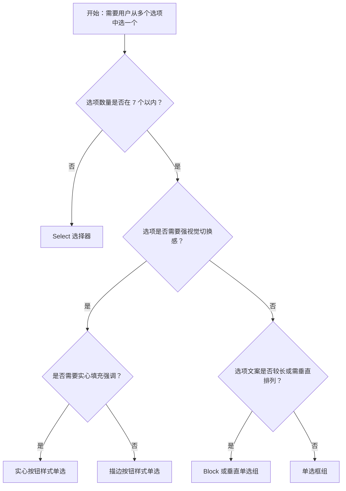

# 1. 简洁易读部份

## 1.0. 组件描述

单选框（Radio）用于在多个互斥备选项中选中唯一一项，所有选项默认可见，便于用户比较后做出选择，因此选项数量不宜过多。与 Select 不同，Radio 强调选项直接展示、无需展开，适用于选项少且需并排对比的场景。

## 1.1. 组件构成

单选框由以下基础要素构成，可按需组合使用：

<!-- 附图占位：建议附上一张示例图，展示单选框的三个基础要素（圆点/选中指示器、文本标签、可选容器）的构成关系，标注各要素名称与位置 -->
<!-- [▶ 在线演示](https://infrad.shopee.io/playground/?agent_code_id=250) -->
```react
function App() {
  const { Radio, Flex, Typography, Card } = Infrad;
  return (
    <Flex gap={16} wrap="wrap" align="flex-start">
      <Card size="small" title="① 选中指示器" style={{ width: 200 }}>
        <Radio checked>选项</Radio>
      </Card>
      <Card size="small" title="② 文本标签" style={{ width: 200 }}>
        <Typography.Text type="secondary" style={{ fontSize: 12 }}>与圆点紧密关联的说明文案</Typography.Text>
      </Card>
      <Card size="small" title="③ Radio.Group 容器" style={{ width: 220 }}>
        <Radio.Group defaultValue="a">
          <Radio value="a">互斥 A</Radio>
          <Radio value="b">互斥 B</Radio>
        </Radio.Group>
      </Card>
    </Flex>
  );
}
```

&emsp;&emsp;1. **选中指示器** 圆形或类似形态的控件，用于表示当前是否被选中。

&emsp;&emsp;2. **文本标签** 说明各选项的含义，必须清晰可读，与指示器在视觉上紧密关联。

&emsp;&emsp;3. **容器** 将一组互斥选项组织在一起，保证同一时刻仅有一项被选中。

---

## 1.2. 组件包含哪些不同类型

### 1.2.1 单选框组

&emsp;**是什么**：一组圆形单选框水平或垂直排列，通过点击选择唯一选项

<!-- 附图占位：建议附上一张示例图，展示单选框组（圆形指示器 + 文本）的视觉形态，体现默认的单选样式 -->
<!-- [▶ 在线演示](https://infrad.shopee.io/playground/?agent_code_id=251) -->
```react
function App() {
  const { Radio } = Infrad;
  return (
    <Radio.Group defaultValue="b">
      <Radio value="a">选项 A</Radio>
      <Radio value="b">选项 B</Radio>
      <Radio value="c">选项 C</Radio>
    </Radio.Group>
  );
}
```

&emsp;**简单用法**：选项数量建议不超过 7 个；同一 Radio.Group 内选项必须互斥；需明确默认选中项或留空

&emsp;**典型场景**：性别选择、支付方式、图表类型切换（折线图/柱状图/饼图）

<!-- 附图占位：建议附上一张场景图，展示表单中性别「男/女」、图表类型「折线图/柱状图/饼图」的单选框组排列 -->
<!-- [▶ 在线演示](https://infrad.shopee.io/playground/?agent_code_id=252) -->
```react
function App() {
  const { Radio, Flex, Typography } = Infrad;
  return (
    <Flex vertical gap={16}>
      <div>
        <Typography.Text type="secondary" style={{ fontSize: 11, display: "block", marginBottom: 4 }}>性别</Typography.Text>
        <Radio.Group defaultValue="m">
          <Radio value="m">男</Radio>
          <Radio value="f">女</Radio>
        </Radio.Group>
      </div>
      <div>
        <Typography.Text type="secondary" style={{ fontSize: 11, display: "block", marginBottom: 4 }}>图表类型</Typography.Text>
        <Radio.Group defaultValue="line">
          <Radio value="line">折线图</Radio>
          <Radio value="bar">柱状图</Radio>
          <Radio value="pie">饼图</Radio>
        </Radio.Group>
      </div>
    </Flex>
  );
}
```

&emsp;**替代方案**：若选项超过 7 个，改用 Select；若需多选，改用 Checkbox

### 1.2.2 单选按钮组（描边样式）

&emsp;**是什么**：以按钮形态展示选项，选中项有描边或边框强调，未选中为浅色背景

<!-- 附图占位：建议附上一张示例图，展示按钮样式单选框（outline 风格）的视觉形态，选中与未选中的对比 -->
<!-- [▶ 在线演示](https://infrad.shopee.io/playground/?agent_code_id=253) -->
```react
function App() {
  const { Radio } = Infrad;
  return (
    <Radio.Group defaultValue="b" optionType="button" buttonStyle="outline">
      <Radio.Button value="a">未选</Radio.Button>
      <Radio.Button value="b">选中 outline</Radio.Button>
      <Radio.Button value="c">另一项</Radio.Button>
    </Radio.Group>
  );
}
```

&emsp;**简单用法**：适用于选项语义类似「切换模式」的场景；按钮之间视觉上紧密相连；选中态需清晰

&emsp;**典型场景**：视图切换（列表/卡片）、排序方式（最新/最热）、筛选维度（全部/进行中/已完成）

<!-- 附图占位：建议附上一张场景图，展示列表页顶部「全部 | 进行中 | 已完成」的按钮式单选布局 -->
<!-- [▶ 在线演示](https://infrad.shopee.io/playground/?agent_code_id=254) -->
```react
function App() {
  const { Radio } = Infrad;
  return (
    <Radio.Group defaultValue="all" optionType="button" buttonStyle="outline">
      <Radio.Button value="all">全部</Radio.Button>
      <Radio.Button value="ing">进行中</Radio.Button>
      <Radio.Button value="done">已完成</Radio.Button>
    </Radio.Group>
  );
}
```

&emsp;**替代方案**：若希望选中项更突出，可选用实心按钮样式

### 1.2.3 实心按钮样式单选

&emsp;**是什么**：选中项以实心填充色（如蓝色）强调，未选中为浅色或描边

<!-- 附图占位：建议附上一张示例图，展示实心按钮样式单选（solid）的视觉形态，选中项蓝色实心填充 -->
<!-- [▶ 在线演示](https://infrad.shopee.io/playground/?agent_code_id=255) -->
```react
function App() {
  const { Radio } = Infrad;
  return (
    <Radio.Group defaultValue="b" optionType="button" buttonStyle="solid">
      <Radio.Button value="a">未选</Radio.Button>
      <Radio.Button value="b">选中 solid</Radio.Button>
      <Radio.Button value="c">另一项</Radio.Button>
    </Radio.Group>
  );
}
```

&emsp;**简单用法**：适用于需要强视觉区分的切换场景；同一组内选项不宜过多；实色应保持品牌一致性

&emsp;**典型场景**：主题切换（亮色/暗色）、重要筛选（如优先级高/中/低）

<!-- 附图占位：建议附上一张场景图，展示筛选区「高/中/低」优先级以实心按钮样式单选的布局 -->
<!-- [▶ 在线演示](https://infrad.shopee.io/playground/?agent_code_id=256) -->
```react
function App() {
  const { Radio } = Infrad;
  return (
    <Radio.Group defaultValue="mid" optionType="button" buttonStyle="solid">
      <Radio.Button value="high">高</Radio.Button>
      <Radio.Button value="mid">中</Radio.Button>
      <Radio.Button value="low">低</Radio.Button>
    </Radio.Group>
  );
}
```

&emsp;**替代方案**：若希望降低视觉权重，改用描边按钮样式

### 1.2.4 Block 单选组合

&emsp;**是什么**：单选框组宽度撑满父容器，每个选项独占一行或占满可用空间

<!-- 附图占位：建议附上一张示例图，展示 Block 单选组合的视觉形态，每个选项横向铺满 -->
<!-- [▶ 在线演示](https://infrad.shopee.io/playground/?agent_code_id=257) -->
```react
function App() {
  const { Radio } = Infrad;
  return (
    <Radio.Group
      defaultValue="hz"
      optionType="button"
      style={{ display: "flex", flexDirection: "column", gap: 8, width: "100%", maxWidth: 320 }}
    >
      <Radio.Button value="hz" style={{ width: "100%", textAlign: "left" }}>杭州仓 · 次日达</Radio.Button>
      <Radio.Button value="sh" style={{ width: "100%", textAlign: "left" }}>上海仓 · 标准配送</Radio.Button>
      <Radio.Button value="bj" style={{ width: "100%", textAlign: "left" }}>北京仓 · 自提点</Radio.Button>
    </Radio.Group>
  );
}
```

&emsp;**简单用法**：适用于选项较多或文案较长的场景；垂直排列更利于阅读；需保证点击区域充足

&emsp;**典型场景**：地区选择（杭州/上海/北京/成都）、收货地址选择、配送方式

<!-- 附图占位：建议附上一张场景图，展示收货地址选择中每个选项为一块可点击区域、撑满宽度的布局 -->
<!-- [▶ 在线演示](https://infrad.shopee.io/playground/?agent_code_id=258) -->
```react
function App() {
  const { Radio } = Infrad;
  return (
    <Radio.Group
      defaultValue="addr1"
      optionType="button"
      style={{ display: "flex", flexDirection: "column", gap: 8, width: "100%", maxWidth: 360 }}
    >
      <Radio.Button value="addr1" style={{ width: "100%", textAlign: "left" }}>张三 · 科技园 A 座</Radio.Button>
      <Radio.Button value="addr2" style={{ width: "100%", textAlign: "left" }}>李四 · 滨江路 88 号</Radio.Button>
    </Radio.Group>
  );
}
```

&emsp;**替代方案**：若选项少且文案短，使用普通水平或垂直单选即可

### 1.2.5 垂直排列单选框组

&emsp;**是什么**：选项垂直堆叠，适用于选项较多或需与「其他」输入框联动

<!-- 附图占位：建议附上一张示例图，展示垂直排列的单选框组，以及「其他」选项旁联动输入框 -->
<!-- [▶ 在线演示](https://infrad.shopee.io/playground/?agent_code_id=259) -->
```react
function App() {
  const { Radio, Input, Flex } = Infrad;
  const [v, setV] = React.useState("a");
  return (
    <Flex vertical gap={8} style={{ maxWidth: 280 }}>
      <Radio.Group value={v} onChange={(e) => setV(e.target.value)}>
        <Flex vertical gap={8}>
          <Radio value="a">选项 A</Radio>
          <Radio value="b">选项 B</Radio>
          <Flex align="center" gap={8}>
            <Radio value="o">其他</Radio>
            <Input size="small" placeholder="请输入" disabled={v !== "o"} style={{ flex: 1 }} />
          </Flex>
        </Flex>
      </Radio.Group>
    </Flex>
  );
}
```

&emsp;**简单用法**：选项数量适中时可垂直排列；若最后一项为「其他」，可联动输入框收集自定义内容；间距需保证可点击性

&emsp;**典型场景**：反馈渠道选择、问题类型选择（带其他说明）

<!-- 附图占位：建议附上一张场景图，展示反馈表单中「选项 A / 选项 B / 其他（请输入）」的垂直单选布局 -->
<!-- [▶ 在线演示](https://infrad.shopee.io/playground/?agent_code_id=260) -->
```react
function App() {
  const { Radio, Input, Flex, Typography } = Infrad;
  return (
    <Flex vertical gap={8} style={{ maxWidth: 300 }}>
      <Typography.Text strong style={{ fontSize: 12 }}>反馈渠道</Typography.Text>
      <Radio.Group defaultValue="email">
        <Flex vertical gap={8}>
          <Radio value="email">选项 A · 邮件</Radio>
          <Radio value="phone">选项 B · 电话</Radio>
          <Radio value="other">其他（请输入）</Radio>
        </Flex>
      </Radio.Group>
      <Input size="small" placeholder="补充说明" />
    </Flex>
  );
}
```

&emsp;**替代方案**：若选项很少，水平排列更紧凑

### 1.2.6 禁用状态

&emsp;**是什么**：单个或整组单选框不可点击，用于权限不足或流程未到该步

<!-- 附图占位：建议附上一张示例图，展示禁用状态的单选框（灰色、不可点击）与正常状态的对比 -->
<!-- [▶ 在线演示](https://infrad.shopee.io/playground/?agent_code_id=261) -->
```react
function App() {
  const { Radio, Flex, Typography } = Infrad;
  return (
    <Flex gap={24} wrap="wrap" align="flex-start">
      <div>
        <Typography.Text type="secondary" style={{ fontSize: 11 }}>正常</Typography.Text>
        <Radio.Group defaultValue="a">
          <Radio value="a">可用</Radio>
          <Radio value="b">可用</Radio>
        </Radio.Group>
      </div>
      <div>
        <Typography.Text type="secondary" style={{ fontSize: 11 }}>禁用</Typography.Text>
        <Radio.Group defaultValue="a" disabled>
          <Radio value="a">整组禁用</Radio>
          <Radio value="b">不可点</Radio>
        </Radio.Group>
      </div>
    </Flex>
  );
}
```

&emsp;**简单用法**：禁用时视觉上明确区分为不可操作；可配合 Tooltip 说明禁用原因；不宜大面积整组禁用

&emsp;**典型场景**：权限受限的表单、已锁定配置的展示、流程中的只读步骤

<!-- 附图占位：建议附上一张场景图，展示部分选项禁用、悬停时提示「无权限」的使用方式 -->
<!-- [▶ 在线演示](https://infrad.shopee.io/playground/?agent_code_id=262) -->
```react
function App() {
  const { Radio, Tooltip, Flex } = Infrad;
  return (
    <Flex vertical gap={8}>
      <Radio.Group defaultValue="a">
        <Radio value="a">有权限</Radio>
        <Tooltip title="无权限">
          <span>
            <Radio value="b" disabled>
              受限选项
            </Radio>
          </span>
        </Tooltip>
      </Radio.Group>
    </Flex>
  );
}
```

&emsp;**替代方案**：若整块区域不可操作，可隐藏或折叠该区块

### 1.2.7 配置方式

&emsp;**是什么**：通过 options 配置渲染单选框，而非手写每个 Radio 子节点

<!-- 附图占位：建议附上一张示例图，展示通过 options 配置的单选框组，与手写 Radio 在视觉上一致 -->
<!-- [▶ 在线演示](https://infrad.shopee.io/playground/?agent_code_id=263) -->
```react
function App() {
  const { Radio, Flex, Typography } = Infrad;
  return (
    <Flex gap={24} wrap="wrap" vertical>
      <div>
        <Typography.Text type="secondary" style={{ fontSize: 11 }}>手写 Radio</Typography.Text>
        <Radio.Group defaultValue="x">
          <Radio value="x">甲</Radio>
          <Radio value="y">乙</Radio>
        </Radio.Group>
      </div>
      <div>
        <Typography.Text type="secondary" style={{ fontSize: 11 }}>options 配置（视觉一致）</Typography.Text>
        <Radio.Group
          defaultValue="x"
          options={[
            { label: "甲", value: "x" },
            { label: "乙", value: "y" },
          ]}
        />
      </div>
    </Flex>
  );
}
```

&emsp;**简单用法**：选项来源于配置或接口时推荐使用；可配合 optionType 切换为按钮样式；便于维护与扩展

&emsp;**典型场景**：动态选项、多语言选项、与后端配置联动的表单

<!-- 附图占位：建议附上一张场景图，展示通过配置生成的单选框组，选项可动态变化 -->
<!-- [▶ 在线演示](https://infrad.shopee.io/playground/?agent_code_id=264) -->
```react
function App() {
  const { Radio, Button, Flex, Typography } = Infrad;
  const [opts, setOpts] = React.useState([
    { label: "动态 1", value: "1" },
    { label: "动态 2", value: "2" },
  ]);
  return (
    <Flex vertical gap={8}>
      <Radio.Group defaultValue="1" options={opts} />
      <Button size="small" onClick={() => setOpts((o) => [...o, { label: "新项 " + (o.length + 1), value: String(o.length + 1) }])}>追加选项</Button>
    </Flex>
  );
}
```

&emsp;**替代方案**：选项固定且结构简单时，手写 Radio 也可接受

---

## 1.3. 各类型典型场景案例

### 1.3.1 单选框组与选项数量

<!-- 附图占位：建议附上一张对比图，左侧展示 3–5 个选项的单选框组（符合规范），右侧展示 10 个以上选项平铺造成拥挤（违反规范） -->
<!-- [▶ 在线演示](https://infrad.shopee.io/playground/?agent_code_id=265) -->
```react
function App() {
  const { Radio, Flex, Typography, Tag } = Infrad;
  const few = ["A", "B", "C", "D", "E"].map((x) => ({ label: x, value: x }));
  const many = Array.from({ length: 12 }, (_, i) => ({ label: "项 " + (i + 1), value: String(i) }));
  return (
    <Flex gap={16} wrap="wrap">
      <div style={{ border: "1px solid #b7eb8f", borderRadius: 8, padding: 8 }}>
        <Tag color="success">3–5 项</Tag>
        <Typography.Text style={{ fontSize: 11, display: "block", margin: "6px 0" }}>便于扫读</Typography.Text>
        <Radio.Group options={few.slice(0, 4)} defaultValue="A" />
      </div>
      <div style={{ border: "1px solid #ffccc7", borderRadius: 8, padding: 8, maxWidth: 280 }}>
        <Tag color="error">过多平铺</Tag>
        <Typography.Text style={{ fontSize: 11, display: "block", margin: "6px 0" }}>应改用 Select</Typography.Text>
        <Radio.Group options={many} defaultValue="0" />
      </div>
    </Flex>
  );
}
```

✅ **推荐：** 选项数量控制在 7 个以内，使用单选框组便于比较选择

<hr>

❌ **不推荐：** 选项过多时仍使用单选框，造成界面拥挤、选择困难，应改用 Select

### 1.3.2 按钮样式与语义

<!-- 附图占位：建议附上一张对比图，左侧展示按钮样式用于模式切换、语义清晰（符合规范），右侧展示用按钮样式承载不相关的长列表选项（违反规范） -->
<!-- [▶ 在线演示](https://infrad.shopee.io/playground/?agent_code_id=266) -->
```react
function App() {
  const { Radio, Flex, Typography, Tag } = Infrad;
  return (
    <Flex gap={16} wrap="wrap">
      <div style={{ border: "1px solid #b7eb8f", borderRadius: 8, padding: 8 }}>
        <Tag color="success">模式切换</Tag>
        <Radio.Group optionType="button" defaultValue="list" buttonStyle="outline">
          <Radio.Button value="list">列表</Radio.Button>
          <Radio.Button value="card">卡片</Radio.Button>
        </Radio.Group>
      </div>
      <div style={{ border: "1px solid #ffccc7", borderRadius: 8, padding: 8 }}>
        <Tag color="error">长列表误用</Tag>
        <Typography.Text type="secondary" style={{ fontSize: 10, display: "block", marginBottom: 6 }}>不相关长文案挤在按钮组</Typography.Text>
        <Radio.Group optionType="button" defaultValue="a" buttonStyle="outline">
          <Radio.Button value="a">非常长的选项描述一</Radio.Button>
          <Radio.Button value="b">非常长的选项描述二</Radio.Button>
        </Radio.Group>
      </div>
    </Flex>
  );
}
```

✅ **推荐：** 按钮样式用于「切换模式」「筛选维度」等语义相近的少量选项

<hr>

❌ **不推荐：** 用按钮样式承载大量或语义差异大的选项，导致视觉混乱

### 1.3.3 Block 与垂直排列

<!-- 附图占位：建议附上一张对比图，左侧展示 Block 或垂直排列时每项可点击区域充足（符合规范），右侧展示选项过密、点击困难（违反规范） -->
<!-- [▶ 在线演示](https://infrad.shopee.io/playground/?agent_code_id=267) -->
```react
function App() {
  const { Radio, Flex, Typography, Tag } = Infrad;
  return (
    <Flex gap={16} wrap="wrap">
      <div style={{ border: "1px solid #b7eb8f", borderRadius: 8, padding: 8, minWidth: 160 }}>
        <Tag color="success">充足点击区</Tag>
        <Radio.Group optionType="button" style={{ display: "flex", flexDirection: "column", gap: 8, width: "100%" }} defaultValue="a">
          <Radio.Button value="a" style={{ width: "100%", textAlign: "left" }}>较长选项文案示例</Radio.Button>
          <Radio.Button value="b" style={{ width: "100%", textAlign: "left" }}>另一项</Radio.Button>
        </Radio.Group>
      </div>
      <div style={{ border: "1px solid #ffccc7", borderRadius: 8, padding: 8 }}>
        <Tag color="error">过密</Tag>
        <Radio.Group optionType="button" buttonStyle="outline" size="small" defaultValue="a">
          <Radio.Button value="a">甲</Radio.Button>
          <Radio.Button value="b">乙</Radio.Button>
          <Radio.Button value="c">丙</Radio.Button>
          <Radio.Button value="d">丁</Radio.Button>
        </Radio.Group>
      </div>
    </Flex>
  );
}
```

✅ **推荐：** 选项较多或文案较长时使用 Block 或垂直排列，保证可点击区域与可读性

<hr>

❌ **不推荐：** 长选项仍横向挤压排列，导致文字截断或点击区域过小

### 1.3.4 与 Select 的选择

<!-- 附图占位：建议附上一张对比图，左侧展示 5 项以内用 Radio、5 项以上用 Select（符合规范），右侧展示 2 项用 Select 或 15 项用 Radio（违反规范） -->
<!-- [▶ 在线演示](https://infrad.shopee.io/playground/?agent_code_id=268) -->
```react
function App() {
  const { Radio, Select, Flex, Typography, Tag } = Infrad;
  return (
    <Flex gap={16} wrap="wrap">
      <div style={{ border: "1px solid #b7eb8f", borderRadius: 8, padding: 8 }}>
        <Tag color="success">少项 Radio</Tag>
        <Radio.Group defaultValue="a">
          <Radio value="a">是</Radio>
          <Radio value="b">否</Radio>
        </Radio.Group>
      </div>
      <div style={{ border: "1px solid #b7eb8f", borderRadius: 8, padding: 8, minWidth: 160 }}>
        <Tag color="success">多项 Select</Tag>
        <Select defaultValue="1" style={{ width: "100%" }} options={Array.from({ length: 8 }, (_, i) => ({ value: String(i), label: "选项 " + (i + 1) }))} />
      </div>
      <div style={{ border: "1px solid #ffccc7", borderRadius: 8, padding: 8 }}>
        <Tag color="error">反例</Tag>
        <Typography.Text style={{ fontSize: 10, display: "block", marginBottom: 6 }}>2 项仍用下拉</Typography.Text>
        <Select style={{ width: 120 }} options={[{ value: "a", label: "A" }, { value: "b", label: "B" }]} />
      </div>
    </Flex>
  );
}
```

✅ **推荐：** 选项少（5 项以内）且需并排比较时用 Radio；选项多或空间紧张时用 Select

<hr>

❌ **不推荐：** 仅 2–3 项却用 Select 增加点击步骤；或 10 项以上仍用 Radio 平铺

---

# 2. 选型指南

## 2.1 选择流程




---

# 3. 细致专业部份（交互与排版规则）

为保证单选框的可用性与一致性，请参考以下设计规则：

## 3.1 选项数量与布局

* **数量上限**：单选框组建议选项不超过 7 个；超出时应考虑 Select、分段控件（Segmented）或分组展示。
* **水平与垂直**：选项少、文案短时优先水平排列；选项多或文案长时垂直排列更易扫读。
* **Block 使用**：当每个选项需要较大点击区域或需展示附加信息时，使用 Block 撑满父宽。

<!-- 附图占位：建议附上一张场景图，展示水平单选组、垂直单选组、Block 单选组三种布局的适用场景对比 -->
<!-- [▶ 在线演示](https://infrad.shopee.io/playground/?agent_code_id=269) -->
```react
function App() {
  const { Radio, Flex, Typography } = Infrad;
  return (
    <Flex gap={24} wrap="wrap" align="flex-start">
      <div>
        <Typography.Text type="secondary" style={{ fontSize: 11, display: "block", marginBottom: 4 }}>水平</Typography.Text>
        <Radio.Group defaultValue="a">
          <Radio value="a">A</Radio>
          <Radio value="b">B</Radio>
        </Radio.Group>
      </div>
      <div>
        <Typography.Text type="secondary" style={{ fontSize: 11, display: "block", marginBottom: 4 }}>垂直</Typography.Text>
        <Radio.Group defaultValue="a">
          <Flex vertical gap={8}>
            <Radio value="a">A</Radio>
            <Radio value="b">B</Radio>
          </Flex>
        </Radio.Group>
      </div>
      <div style={{ width: 200 }}>
        <Typography.Text type="secondary" style={{ fontSize: 11, display: "block", marginBottom: 4 }}>Block</Typography.Text>
        <Radio.Group optionType="button" defaultValue="a" style={{ display: "flex", flexDirection: "column", gap: 8, width: "100%" }}>
          <Radio.Button value="a" style={{ width: "100%", textAlign: "left" }}>宽按钮 A</Radio.Button>
          <Radio.Button value="b" style={{ width: "100%", textAlign: "left" }}>宽按钮 B</Radio.Button>
        </Radio.Group>
      </div>
    </Flex>
  );
}
```

## 3.2 与表单的配合

* **必填与默认值**：若为必填项，需设置默认值或明确引导用户选择；避免提交时才发现未选。
* **与其它控件联动**：「其他」选项可联动输入框，需在交互上明确二者关系。
* **校验反馈**：校验失败时，错误提示应靠近单选框组，不遮挡选项本身。

<!-- 附图占位：建议附上一张场景图，展示必填单选框校验失败时的提示位置与样式 -->
<!-- [▶ 在线演示](https://infrad.shopee.io/playground/?agent_code_id=270) -->
```react
function App() {
  const { Form, Radio, Flex } = Infrad;
  return (
    <Form style={{ maxWidth: 320 }}>
      <Form.Item label="类型" required validateStatus="error" help="请选择一项">
        <Radio.Group>
          <Radio value="a">A</Radio>
          <Radio value="b">B</Radio>
        </Radio.Group>
      </Form.Item>
    </Form>
  );
}
```

## 3.3 按钮样式的视觉层级

* **描边样式**：适用于需弱化视觉权重的切换场景，选中态通过描边或背景区分。
* **实心样式**：适用于需强调当前选中状态的场景，实色填充应保持与主色一致。
* **一致性**：同一页面内，同类切换场景应统一使用描边或实心，避免混用。

<!-- 附图占位：建议附上一张对比图，展示描边与实心按钮样式在相同场景下的视觉差异 -->
<!-- [▶ 在线演示](https://infrad.shopee.io/playground/?agent_code_id=271) -->
```react
function App() {
  const { Radio, Flex, Typography } = Infrad;
  return (
    <Flex gap={24} wrap="wrap" vertical>
      <div>
        <Typography.Text type="secondary" style={{ fontSize: 11 }}>outline</Typography.Text>
        <Radio.Group defaultValue="a" optionType="button" buttonStyle="outline">
          <Radio.Button value="a">最新</Radio.Button>
          <Radio.Button value="b">最热</Radio.Button>
        </Radio.Group>
      </div>
      <div>
        <Typography.Text type="secondary" style={{ fontSize: 11 }}>solid</Typography.Text>
        <Radio.Group defaultValue="a" optionType="button" buttonStyle="solid">
          <Radio.Button value="a">最新</Radio.Button>
          <Radio.Button value="b">最热</Radio.Button>
        </Radio.Group>
      </div>
    </Flex>
  );
}
```

## 3.4 顺序与分组

* **顺序**：选项顺序应符合业务逻辑或用户习惯（如按频率、按字母、按流程）。
* **分组**：若选项可逻辑分组，可用标题或分割线区分，但同一 Radio.Group 内仍保持互斥。
* **「其他」位置**：若存在「其他」选项，通常置于最后，并联动自定义输入。

## 3.5 状态与交互反馈

* **默认**：未选中项清晰可点击，选中项明确标识。
* **悬停**：悬停时应有可点击暗示（如背景或描边变化）。
* **禁用**：禁用时视觉降级（如灰色），且不可点击；可配合 Tooltip 说明原因。
* **焦点**：键盘导航时焦点可见，支持方向键在同一组内切换选项。

## 3.6 无障碍与键盘

* **name 属性**：Radio.Group 应设置 name，使浏览器将一组 Radio 识别为同一组，支持方向键在同一组内切换。
* **标签关联**：每个选项的文本需与对应的 input 正确关联，便于读屏器识别。
* **焦点顺序**：Tab 进入组后，焦点应先落在当前选中项或第一项，再通过方向键切换。

<!-- 附图占位：建议附上一张示例图，展示 Radio.Group 的键盘导航流程（Tab 进入、方向键切换、Enter 确认） -->
<!-- [▶ 在线演示](https://infrad.shopee.io/playground/?agent_code_id=272) -->
```react
function App() {
  const { Radio, Flex, Typography, Tag } = Infrad;
  return (
    <Flex vertical gap={12} style={{ maxWidth: 360 }}>
      <Typography.Text type="secondary" style={{ fontSize: 12 }}>
        Radio.Group 设置 <Tag>name</Tag> 后，Tab 进入组内可用方向键切换选项，Enter 确认。
      </Typography.Text>
      <Radio.Group name="demo-nav-group" defaultValue="b">
        <Flex vertical gap={8}>
          <Radio value="a">第一项（失焦后 Tab 聚焦到选中项）</Radio>
          <Radio value="b">第二项（当前选中）</Radio>
          <Radio value="c">第三项</Radio>
        </Flex>
      </Radio.Group>
    </Flex>
  );
}
```

---

## 4.0. 常见问题

### 1. Radio 和 Select 怎么选？

- **Radio**：选项少（建议 5–7 个以内），且希望**全部可见、便于比较**时使用。如性别、支付方式、图表类型。
- **Select**：选项多、或空间有限、需要**收起选项**时使用。如城市选择、长列表。

### 2. 单选按钮和普通单选框的区别？

- **普通单选框**：圆形指示器 + 文本，占用空间小，适合表单内紧凑排列。
- **单选按钮**：按钮形态，视觉权重更高，适合**模式切换、筛选维度**等需要强调「当前选中项」的场景。描边样式较克制，实心样式更醒目。

### 3. 何时使用 Block 单选组合？

- 选项较多或文案较长，需要**每项独占一行**以提升可读性。
- 需要**更大的点击区域**，如移动端或触屏场景。
- 每个选项需要**展示附加信息**（如说明文字、图标），需要更多空间时。
