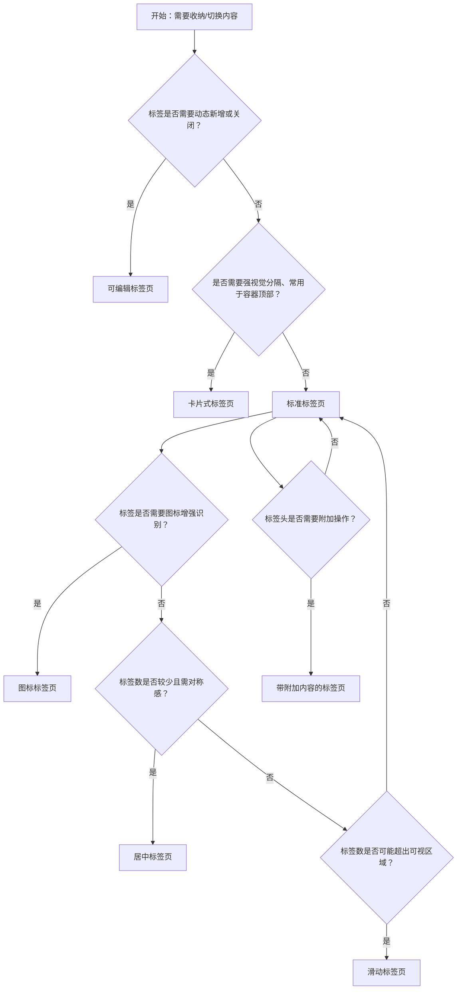

# 1. 简洁易读部份

## 1.0. 组件描述

标签页用于将大块内容按平级维度进行收纳和展现，通过切换不同标签在有限区域内展示不同内容，保持界面整洁并降低信息密度。

## 1.1. 组件构成

标签页由以下基础要素构成，可按需组合使用：

<!-- 附图占位：建议附上一张示例图，展示标签页的基础要素（标签头、指示条、内容区、附加操作区）的构成关系，标注各要素名称与位置 -->
<!-- [▶ 在线演示](https://infrad.shopee.io/playground/?agent_code_id=227) -->
```react
function App() {
  const { Tabs, Flex, Typography, Button, Divider } = Infrad;
  const items = [
    { key: "1", label: "标签头", children: <Typography.Text type="secondary">各标签标题、图标、切换入口</Typography.Text> },
    { key: "2", label: "指示条", children: <Typography.Text type="secondary">标识当前激活项（线条或背景）</Typography.Text> },
  ];
  return (
    <Flex vertical gap={12} style={{ maxWidth: 520 }}>
      <Typography.Text type="secondary" style={{ fontSize: 12 }}>下方示例中：顶栏为标签头 + 右侧附加区；线条为指示条；此区域为内容区。</Typography.Text>
      <Tabs
        tabBarExtraContent={<Button size="small" type="link">附加操作区</Button>}
        items={items}
      />
      <Divider style={{ margin: "4px 0" }} />
      <Typography.Text style={{ fontSize: 12 }}>① 标签头 ② 指示条 ③ 内容区 ④ 附加操作区（示意）</Typography.Text>
    </Flex>
  );
}
```

&emsp;&emsp;1. **标签头** 承载各标签的标题，可含图标或徽标，定义切换入口与当前选中态。

&emsp;&emsp;2. **指示条** 标识当前激活标签，通常为底部线条或背景高亮。

&emsp;&emsp;3. **内容区** 展示当前选中标签下的具体内容，与标签头分离。

&emsp;&emsp;4. **附加操作区** 可置于标签头左右两侧，承载与标签相关的操作（如新增、刷新、筛选）。

---

## 1.2. 组件包含哪些不同类型

### 1.2.1 标准标签页

&emsp;**是什么**：标签头为线条样式，底部指示条标识当前项，标签之间平级切换

<!-- 附图占位：建议附上一张示例图，展示标准标签页的形态（标签 1、标签 2、标签 3 横向排列，底部指示条，内容区 below），体现最通用的线条式标签形态 -->
<!-- [▶ 在线演示](https://infrad.shopee.io/playground/?agent_code_id=228) -->
```react
function App() {
  const { Tabs } = Infrad;
  return (
    <Tabs
      defaultActiveKey="1"
      type="line"
      items={[
        { key: "1", label: "标签 1", children: <div style={{ padding: 12, background: "#fafafa", borderRadius: 6 }}>内容区：标签 1</div> },
        { key: "2", label: "标签 2", children: <div style={{ padding: 12, background: "#fafafa", borderRadius: 6 }}>内容区：标签 2</div> },
        { key: "3", label: "标签 3", children: <div style={{ padding: 12, background: "#fafafa", borderRadius: 6 }}>内容区：标签 3</div> },
      ]}
    />
  );
}
```

&emsp;**简单用法**：适用于大多数内容收纳场景；标签数不宜过多，空间不足时可滑动或折叠；既可用于容器顶部也可用于容器内部

&emsp;**典型场景**：详情页多维度信息（基本信息、历史记录、关联数据）、设置页多分类、数据报表多视图

<!-- 附图占位：建议附上一张场景图，展示详情页「基本信息」「操作记录」「关联工单」等标准标签的布局，体现多维度内容收纳 -->
<!-- [▶ 在线演示](https://infrad.shopee.io/playground/?agent_code_id=229) -->
```react
function App() {
  const { Tabs, Descriptions } = Infrad;
  return (
    <Tabs
      defaultActiveKey="base"
      items={[
        { key: "base", label: "基本信息", children: <Descriptions size="small" column={1} items={[{ label: "单号", children: "WO-1024" }, { label: "状态", children: "处理中" }]} /> },
        { key: "log", label: "操作记录", children: <div style={{ padding: 8, color: "#888", fontSize: 12 }}>2026-04-01 提交 · 2026-04-02 指派</div> },
        { key: "rel", label: "关联工单", children: <div style={{ padding: 8, fontSize: 12 }}>#8821 · #8822</div> },
      ]}
    />
  );
}
```

&emsp;**替代方案**：若需可关闭或新增标签，改用可编辑标签页；若需更强视觉分隔，改用卡片式标签页

### 1.2.2 卡片式标签页

&emsp;**是什么**：标签头为卡片样式，选中标签有背景块与边框，视觉上更突出

<!-- 附图占位：建议附上一张示例图，展示卡片式标签页的形态（标签块状、选中项有背景色与边框），体现卡片式与标准线条式的视觉差异 -->
<!-- [▶ 在线演示](https://infrad.shopee.io/playground/?agent_code_id=230) -->
```react
function App() {
  const { Tabs } = Infrad;
  return (
    <Tabs
      type="card"
      defaultActiveKey="1"
      items={[
        { key: "1", label: "卡片 1", children: <div style={{ padding: 12 }}>选中项有背景块与边框</div> },
        { key: "2", label: "卡片 2", children: <div style={{ padding: 12 }}>内容 2</div> },
        { key: "3", label: "卡片 3", children: <div style={{ padding: 12 }}>内容 3</div> },
      ]}
    />
  );
}
```

&emsp;**简单用法**：常用于容器顶部；不提供垂直样式；视觉权重高于标准标签页，适合主流程或强调标签切换的场景

&emsp;**典型场景**：控制台首页多模块、工作台多视图、仪表盘多数据看板

<!-- 附图占位：建议附上一张场景图，展示工作台顶部「今日任务」「待办」「已完成」等卡片式标签的布局，体现主流程中的标签切换 -->
<!-- [▶ 在线演示](https://infrad.shopee.io/playground/?agent_code_id=231) -->
```react
function App() {
  const { Tabs, Tag } = Infrad;
  return (
    <Tabs
      type="card"
      defaultActiveKey="today"
      items={[
        { key: "today", label: <span>今日任务 <Tag color="blue">3</Tag></span>, children: <div style={{ padding: 12, fontSize: 12 }}>待办条目 …</div> },
        { key: "todo", label: "待办", children: <div style={{ padding: 12, fontSize: 12 }}>队列 …</div> },
        { key: "done", label: "已完成", children: <div style={{ padding: 12, fontSize: 12 }}>历史 …</div> },
      ]}
    />
  );
}
```

&emsp;**替代方案**：若为次级内容或轻量切换，使用标准标签页即可

### 1.2.3 可编辑标签页

&emsp;**是什么**：在卡片式基础上支持新增与关闭标签，每个标签可有关闭图标

<!-- 附图占位：建议附上一张示例图，展示可编辑标签页的形态（标签带关闭图标、右侧有「+」新增入口），体现可新增与关闭的交互能力 -->
<!-- [▶ 在线演示](https://infrad.shopee.io/playground/?agent_code_id=232) -->
```react
function App() {
  const { Tabs } = Infrad;
  const [items, setItems] = React.useState([
    { key: "1", label: "文档 A", children: "内容 A", closable: true },
    { key: "2", label: "文档 B", children: "内容 B", closable: true },
  ]);
  const onEdit = (targetKey, action) => {
    if (action === "add") {
      const k = String(Date.now());
      setItems((prev) => [...prev, { key: k, label: "新标签", children: "新内容", closable: true }]);
    } else if (action === "remove" && targetKey) {
      setItems((prev) => prev.filter((i) => i.key !== targetKey));
    }
  };
  return (
    <Tabs type="editable-card" onEdit={onEdit} items={items} />
  );
}
```

&emsp;**简单用法**：必须用于需要动态增删标签的场景；至少保留一个标签不可关闭；新增标签需有明确触发入口

&emsp;**典型场景**：多文档编辑、多工单/会话切换、浏览器式多标签工作区

<!-- 附图占位：建议附上一张场景图，展示多文档编辑器中可新增、可关闭的标签栏，体现类似浏览器的多标签工作方式 -->
<!-- [▶ 在线演示](https://infrad.shopee.io/playground/?agent_code_id=233) -->
```react
function App() {
  const { Tabs } = Infrad;
  const [items, setItems] = React.useState([
    { key: "1", label: "工单 #12", children: "编辑器内容 …", closable: true },
    { key: "2", label: "工单 #15", children: "编辑器内容 …", closable: true },
  ]);
  const onEdit = (targetKey, action) => {
    if (action === "add") {
      const k = String(Date.now());
      setItems((prev) => [...prev, { key: k, label: "新会话", children: "未命名", closable: true }]);
    } else if (action === "remove" && targetKey) {
      setItems((prev) => (prev.length <= 1 ? prev : prev.filter((i) => i.key !== targetKey)));
    }
  };
  return (
    <Tabs type="editable-card" onEdit={onEdit} items={items} />
  );
}
```

&emsp;**替代方案**：若标签固定不需增删，使用标准或卡片式标签页

### 1.2.4 图标标签页

&emsp;**是什么**：标签头可含图标，图标与文字组合或仅图标，增强识别效率

<!-- 附图占位：建议附上一张示例图，展示图标标签页的形态（标签 1 图标+文字、标签 2 图标+文字），体现图标对标签语义的增强 -->
<!-- [▶ 在线演示](https://infrad.shopee.io/playground/?agent_code_id=234) -->
```react
function App() {
  const { Tabs } = Infrad;
  const { AppstoreOutlined, SettingOutlined, BellOutlined } = Icons;
  return (
    <Tabs
      defaultActiveKey="1"
      items={[
        { key: "1", label: <span><AppstoreOutlined /> 标签 1</span>, children: <div style={{ padding: 12 }}>模块 A</div> },
        { key: "2", label: <span><SettingOutlined /> 标签 2</span>, children: <div style={{ padding: 12 }}>模块 B</div> },
        { key: "3", label: <span><BellOutlined /> 标签 3</span>, children: <div style={{ padding: 12 }}>模块 C</div> },
      ]}
    />
  );
}
```

&emsp;**简单用法**：图标需与标签语义一致；适用于标签较多需快速区分的场景；可单独使用图标（如空间紧张）

&emsp;**典型场景**：设置页多分类（通用、安全、通知等）、功能模块切换、移动端紧凑标签

<!-- 附图占位：建议附上一张场景图，展示设置页「通用」「安全」「通知」等带图标的标签布局，体现图标与分类的对应关系 -->
<!-- [▶ 在线演示](https://infrad.shopee.io/playground/?agent_code_id=235) -->
```react
function App() {
  const { Tabs } = Infrad;
  const { ControlOutlined, SafetyOutlined, NotificationOutlined } = Icons;
  return (
    <Tabs
      defaultActiveKey="gen"
      items={[
        { key: "gen", label: <span><ControlOutlined /> 通用</span>, children: <div style={{ padding: 12, fontSize: 12 }}>语言、主题</div> },
        { key: "sec", label: <span><SafetyOutlined /> 安全</span>, children: <div style={{ padding: 12, fontSize: 12 }}>登录、设备</div> },
        { key: "not", label: <span><NotificationOutlined /> 通知</span>, children: <div style={{ padding: 12, fontSize: 12 }}>邮件、推送</div> },
      ]}
    />
  );
}
```

&emsp;**替代方案**：若标签语义清晰无需图标，使用纯文字标签即可

### 1.2.5 居中标签页

&emsp;**是什么**：标签头在容器内居中对齐展示，而非默认左对齐

<!-- 附图占位：建议附上一张示例图，展示居中标签页的形态（标签整体居中排列），体现居中与左对齐的视觉差异 -->
<!-- [▶ 在线演示](https://infrad.shopee.io/playground/?agent_code_id=236) -->
```react
function App() {
  const { Tabs } = Infrad;
  return (
    <Tabs
      centered
      defaultActiveKey="1"
      items={[
        { key: "1", label: "左", children: <div style={{ padding: 12, textAlign: "center" }}>标签组整体居中</div> },
        { key: "2", label: "中", children: <div style={{ padding: 12, textAlign: "center" }}>内容</div> },
        { key: "3", label: "右", children: <div style={{ padding: 12, textAlign: "center" }}>内容</div> },
      ]}
    />
  );
}
```

&emsp;**简单用法**：适用于标签数少、需要对称平衡感的场景；内容区与标签风格一致时效果更好

&emsp;**典型场景**：产品介绍多特性、营销页多卖点、简约风格的内容切换

<!-- 附图占位：建议附上一张场景图，展示产品介绍页「功能」「价格」「案例」等居中标签的布局，体现对称与聚焦 -->
<!-- [▶ 在线演示](https://infrad.shopee.io/playground/?agent_code_id=237) -->
```react
function App() {
  const { Tabs } = Infrad;
  return (
    <Tabs
      centered
      defaultActiveKey="feat"
      items={[
        { key: "feat", label: "功能", children: <div style={{ padding: 16, textAlign: "center" }}>卖点介绍</div> },
        { key: "price", label: "价格", children: <div style={{ padding: 16, textAlign: "center" }}>套餐对比</div> },
        { key: "case", label: "案例", children: <div style={{ padding: 16, textAlign: "center" }}>客户故事</div> },
      ]}
    />
  );
}
```

&emsp;**替代方案**：若为常规后台或表单场景，使用默认左对齐即可

### 1.2.6 滑动标签页

&emsp;**是什么**：标签数量超出可视区域时可左右（或上下）滑动，容纳更多标签

<!-- 附图占位：建议附上一张示例图，展示滑动标签页的形态（多标签横向排列、一侧有滑动箭头或可拖拽），体现超出宽度时的滑动能力 -->
<!-- [▶ 在线演示](https://infrad.shopee.io/playground/?agent_code_id=238) -->
```react
function App() {
  const { Tabs } = Infrad;
  const many = Array.from({ length: 14 }, (_, i) => ({
    key: String(i + 1),
    label: `分类 ${i + 1}`,
    children: <div style={{ padding: 8, fontSize: 12 }}>第 {i + 1} 项内容</div>,
  }));
  return (
    <div style={{ maxWidth: 280, border: "1px solid #f0f0f0", borderRadius: 8, padding: 8 }}>
      <Tabs defaultActiveKey="1" items={many} />
    </div>
  );
}
```

&emsp;**简单用法**：标签数较多时自动启用；需提供滑动暗示（如边缘渐变或箭头）；移动端支持手势滑动

&emsp;**典型场景**：多分类筛选、多模块入口、日期或时间段的切换

<!-- 附图占位：建议附上一张场景图，展示多分类场景下标签可滑动的效果，体现容纳大量标签的方式 -->
<!-- [▶ 在线演示](https://infrad.shopee.io/playground/?agent_code_id=239) -->
```react
function App() {
  const { Tabs, Typography } = Infrad;
  const many = Array.from({ length: 12 }, (_, i) => ({
    key: String(i + 1),
    label: `模块 ${i + 1}`,
    children: <Typography.Text type="secondary" style={{ fontSize: 12 }}>窄屏下可横向滑动浏览标签</Typography.Text>,
  }));
  return (
    <div style={{ maxWidth: 320, border: "1px dashed #d9d9d9", borderRadius: 8, padding: 8 }}>
      <Tabs defaultActiveKey="1" items={many} />
    </div>
  );
}
```

&emsp;**替代方案**：若标签过多，考虑使用下拉或分组收纳，而非无限滑动

### 1.2.7 带附加内容的标签页

&emsp;**是什么**：在标签头两侧可放置附加操作，如按钮、筛选、搜索等

<!-- 附图占位：建议附上一张示例图，展示带附加内容的标签页形态（标签左侧或右侧有「新建」「导出」「筛选」等操作），体现附加内容与标签的配合 -->
<!-- [▶ 在线演示](https://infrad.shopee.io/playground/?agent_code_id=240) -->
```react
function App() {
  const { Tabs, Button, Space } = Infrad;
  const { PlusOutlined, ExportOutlined, FilterOutlined } = Icons;
  return (
    <Tabs
      defaultActiveKey="1"
      tabBarExtraContent={
        <Space size="small">
          <Button size="small" icon={<FilterOutlined />}>筛选</Button>
          <Button size="small" icon={<ExportOutlined />}>导出</Button>
          <Button size="small" type="primary" icon={<PlusOutlined />}>新建</Button>
        </Space>
      }
      items={[
        { key: "1", label: "列表", children: <div style={{ padding: 12, fontSize: 12 }}>表格区域</div> },
        { key: "2", label: "看板", children: <div style={{ padding: 12, fontSize: 12 }}>看板区域</div> },
      ]}
    />
  );
}
```

&emsp;**简单用法**：附加内容与当前标签或标签组相关；可置于左侧或右侧；不抢夺标签切换的主视觉

&emsp;**典型场景**：列表页「全部」「待处理」等标签右侧的「新建」按钮、报表标签旁的「导出」「刷新」

<!-- 附图占位：建议附上一张场景图，展示工单列表「全部」「待处理」「已完成」标签右侧的「新建工单」按钮，体现附加操作的典型位置 -->
<!-- [▶ 在线演示](https://infrad.shopee.io/playground/?agent_code_id=241) -->
```react
function App() {
  const { Tabs, Button } = Infrad;
  const { PlusOutlined } = Icons;
  return (
    <Tabs
      defaultActiveKey="all"
      tabBarExtraContent={<Button type="primary" size="small" icon={<PlusOutlined />}>新建工单</Button>}
      items={[
        { key: "all", label: "全部", children: <div style={{ padding: 12, fontSize: 12 }}>工单列表</div> },
        { key: "pend", label: "待处理", children: <div style={{ padding: 12, fontSize: 12 }}>待办</div> },
        { key: "done", label: "已完成", children: <div style={{ padding: 12, fontSize: 12 }}>归档</div> },
      ]}
    />
  );
}
```

&emsp;**替代方案**：若操作与标签无直接关系，可置于内容区或页面其他位置

---

## 1.3. 各类型典型场景案例

### 1.3.1 标准标签页

<!-- 附图占位：建议附上一张对比图，左侧展示详情页使用标准标签合理收纳多维度信息（符合规范），右侧展示将不相关内容强行塞入同一标签导致混乱（违反规范） -->
<!-- [▶ 在线演示](https://infrad.shopee.io/playground/?agent_code_id=242) -->
```react
function App() {
  const { Tabs, Flex, Typography, Tag } = Infrad;
  return (
    <Flex gap={16} wrap="wrap">
      <div style={{ flex: "1 1 200px", border: "1px solid #b7eb8f", borderRadius: 8, padding: 8 }}>
        <Tag color="success">符合</Tag>
        <Typography.Text strong style={{ marginLeft: 8, fontSize: 12 }}>维度清晰</Typography.Text>
        <Tabs size="small" items={[{ key: "a", label: "概览", children: <div style={{ fontSize: 11, padding: 6 }}>结构化信息</div> }, { key: "b", label: "明细", children: <div style={{ fontSize: 11, padding: 6 }}>表格</div> }]} />
      </div>
      <div style={{ flex: "1 1 200px", border: "1px solid #ffccc7", borderRadius: 8, padding: 8 }}>
        <Tag color="error">避免</Tag>
        <Typography.Text strong style={{ marginLeft: 8, fontSize: 12 }}>强行合并</Typography.Text>
        <Tabs size="small" items={[{ key: "x", label: "全部堆在一起", children: <div style={{ fontSize: 11, padding: 6, color: "#999" }}>无关信息混杂，难以扫描</div> }]} />
      </div>
    </Flex>
  );
}
```

✅ **推荐：** 用标准标签将相关内容按维度分组收纳

<hr>

❌ **不推荐：** 标签内内容杂乱、维度混淆，或标签过多导致选择困难

### 1.3.2 可编辑标签页

<!-- 附图占位：建议附上一张对比图，左侧展示多文档场景使用可编辑标签可新增可关闭（符合规范），右侧展示固定标签场景误用可编辑导致误关（违反规范） -->
<!-- [▶ 在线演示](https://infrad.shopee.io/playground/?agent_code_id=243) -->
```react
function App() {
  const { Tabs, Flex, Typography, Tag } = Infrad;
  return (
    <Flex gap={16} wrap="wrap" align="flex-start">
      <div style={{ flex: "1 1 220px", border: "1px solid #b7eb8f", borderRadius: 8, padding: 8 }}>
        <Tag color="success">符合</Tag>
        <Typography.Paragraph style={{ fontSize: 11, marginBottom: 8 }}>多文档场景 · 可新增可关闭</Typography.Paragraph>
        <Tabs
          type="editable-card"
          size="small"
          defaultActiveKey="1"
          items={[{ key: "1", label: "文档 1", children: "…", closable: true }]}
          onEdit={() => {}}
        />
      </div>
      <div style={{ flex: "1 1 220px", border: "1px solid #ffccc7", borderRadius: 8, padding: 8 }}>
        <Tag color="error">避免</Tag>
        <Typography.Paragraph style={{ fontSize: 11, marginBottom: 8 }}>固定配置项 · 误用可关闭</Typography.Paragraph>
        <Tabs
          type="editable-card"
          size="small"
          defaultActiveKey="1"
          items={[{ key: "1", label: "只读页签", children: "易被误关", closable: true }]}
          onEdit={() => {}}
        />
      </div>
    </Flex>
  );
}
```

✅ **推荐：** 仅在需要动态增删标签时使用可编辑标签页，且至少保留一个不可关闭

<hr>

❌ **不推荐：** 固定标签场景使用可编辑标签，增加误操作风险

### 1.3.3 标签数量与滑动

<!-- 附图占位：建议附上一张对比图，左侧展示标签较多时支持滑动或收纳（符合规范），右侧展示大量标签平铺导致拥挤难以操作（违反规范） -->
<!-- [▶ 在线演示](https://infrad.shopee.io/playground/?agent_code_id=244) -->
```react
function App() {
  const { Tabs, Flex, Typography, Tag } = Infrad;
  const few = [{ key: "1", label: "A", children: "…" }, { key: "2", label: "B", children: "…" }];
  const many = Array.from({ length: 9 }, (_, i) => ({ key: "m" + i, label: "项" + (i + 1), children: "…" }));
  return (
    <Flex gap={16} wrap="wrap">
      <div style={{ width: 200, border: "1px solid #b7eb8f", borderRadius: 8, padding: 8 }}>
        <Tag color="success">可滑动收纳</Tag>
        <Typography.Text style={{ fontSize: 11, display: "block", margin: "6px 0" }}>标签多时可滚动</Typography.Text>
        <Tabs size="small" items={many} />
      </div>
      <div style={{ width: 200, border: "1px solid #ffccc7", borderRadius: 8, padding: 8 }}>
        <Tag color="error">过度平铺</Tag>
        <Typography.Text style={{ fontSize: 11, display: "block", margin: "6px 0" }}>全部挤在一行</Typography.Text>
        <Tabs size="small" items={few} tabBarStyle={{ overflow: "visible" }} />
        <Typography.Text type="secondary" style={{ fontSize: 10 }}>（示意拥挤）</Typography.Text>
      </div>
    </Flex>
  );
}
```

✅ **推荐：** 标签数较多时提供滑动或折叠，保证可操作性

<hr>

❌ **不推荐：** 大量标签无滑动无折叠，平铺导致拥挤难用

---

# 2. 选型指南

## 2.1 选择流程



---

# 3. 细致专业部份（交互与排版规则）

为了保持标签页清晰并符合用户预期，当使用标签页组件时，请参考以下交互与排版规则：

## 3.1 多操作的展示与折叠策略

* **默认展示**：所有标签在空间充足时横向平铺；空间不足时自动滑动或折叠为「更多」下拉菜单。
* **优先展示**：与当前页面核心任务强相关的**主标签**必须直接可见，不可收纳进折叠菜单。
* **折叠原则**：低频或次要标签可收纳；收纳后需提供明确入口（如「更多」图标），点击后展示完整列表。

<!-- 附图占位：建议附上一张场景图，展示标签较多时「主要」「常用」直接可见、其余收纳至「更多」的布局，体现展示与折叠策略 -->
<!-- [▶ 在线演示](https://infrad.shopee.io/playground/?agent_code_id=245) -->
```react
function App() {
  const { Tabs, Dropdown, Button, Flex, Typography } = Infrad;
  const { DownOutlined } = Icons;
  const mainItems = [
    { key: "1", label: "主要", children: <div style={{ padding: 8, fontSize: 12 }}>核心流程</div> },
    { key: "2", label: "常用", children: <div style={{ padding: 8, fontSize: 12 }}>高频入口</div> },
  ];
  const menuItems = [
    { key: "x", label: "归档 A" },
    { key: "y", label: "归档 B" },
    { key: "z", label: "归档 C" },
  ];
  return (
    <Flex vertical gap={8} style={{ maxWidth: 400 }}>
      <Typography.Text type="secondary" style={{ fontSize: 11 }}>主标签常显，次要项收入「更多」下拉</Typography.Text>
      <Tabs
        defaultActiveKey="1"
        tabBarExtraContent={
          <Dropdown menu={{ items: menuItems }} trigger={["click"]}>
            <Button size="small" type="text" icon={<DownOutlined />}>更多</Button>
          </Dropdown>
        }
        items={mainItems}
      />
    </Flex>
  );
}
```

## 3.2 危险操作（删除/清空/停用）

* **可编辑标签页的关闭**：关闭标签为轻量操作，但若关闭后导致未保存内容丢失，需在关闭前提示确认；最后一个标签不可关闭。
* **内容区危险操作**：若标签内容区内含删除、清空等危险操作，需符合危险操作规范（二次确认、视觉警示、位置靠后）。
* **标签与内容一致性**：切换标签时，若当前标签有未保存修改，需提示用户保存或放弃，避免误切导致数据丢失。

<!-- 附图占位：建议附上一张场景图，展示可编辑标签页关闭含未保存内容的标签时弹窗确认的交互，体现防误关机制 -->
<!-- [▶ 在线演示](https://infrad.shopee.io/playground/?agent_code_id=246) -->
```react
function App() {
  const { Tabs, Modal, Button, Typography, Flex } = Infrad;
  const [open, setOpen] = React.useState(false);
  const [items, setItems] = React.useState([
    { key: "1", label: "未保存文档", children: <Typography.Text>编辑中…</Typography.Text>, closable: true },
  ]);
  const onEdit = (targetKey, action) => {
    if (action === "remove") {
      setOpen(true);
    }
  };
  return (
    <Flex vertical gap={8}>
      <Typography.Text type="secondary" style={{ fontSize: 11 }}>关闭含未保存内容的标签前弹出确认</Typography.Text>
      <Tabs type="editable-card" onEdit={onEdit} items={items} />
      <Modal open={open} title="确认关闭？" onOk={() => setOpen(false)} onCancel={() => setOpen(false)} okText="保存并关闭" cancelText="取消">
        <Typography.Text>内容尚未保存，是否关闭当前标签？</Typography.Text>
      </Modal>
    </Flex>
  );
}
```

## 3.3 摆放位置（按页面场景划分）

* **容器顶部**：标签页常见于页面主内容区顶部、卡片顶部、弹窗顶部，与下方内容区紧密相邻。
* **容器内部**：可用于设置页、详情页等内容区块内，作为次级导航或内容分组。
* **侧边位置**：标签可置于容器左侧或右侧（`tabPlacement`），适用于纵向空间充足、需要纵向标签排列的场景。
* **移动端**：`start`/`end` 在移动端会自动切换为 `top`，保证可操作性。

<!-- 附图占位：建议附上一张场景图，展示标签页在容器顶部、容器内部、侧边位置三种摆放方式，体现不同场景下的标准位置 -->
<!-- [▶ 在线演示](https://infrad.shopee.io/playground/?agent_code_id=247) -->
```react
function App() {
  const { Tabs, Flex, Typography, Card } = Infrad;
  const inner = [{ key: "1", label: "子页签", children: <div style={{ fontSize: 11, padding: 4 }}>内部</div> }];
  return (
    <Flex gap={12} wrap="wrap" align="flex-start">
      <Card size="small" title="顶部" style={{ width: 200 }}>
        <Tabs size="small" items={inner} tabPosition="top" />
      </Card>
      <Card size="small" title="内部" style={{ width: 200 }}>
        <div style={{ padding: 8, background: "#fafafa", borderRadius: 6 }}>
          <Tabs size="small" items={inner} tabPosition="top" />
        </div>
      </Card>
      <Card size="small" title="侧边" style={{ width: 220 }}>
        <Tabs size="small" items={inner} tabPosition="left" style={{ minHeight: 80 }} />
      </Card>
    </Flex>
  );
}
```

## 3.4 顺序与对齐逻辑

* **标签顺序**：按业务重要性、使用频率或逻辑关系从左到右（或从上到下）排列；默认选中第一项或与当前路由/状态对应的项。
* **对齐方式**：默认左对齐；居中适用于标签少、需对称的场景；附加内容可左或右对齐，与标签组保持合理间距。
* **内容区对齐**：内容区与标签头左边缘对齐，保证视觉连贯；若有边距需与整体布局统一。

<!-- 附图占位：建议附上一张场景图，展示标签顺序、左对齐与居中两种布局、附加内容位置的视觉规范 -->
<!-- [▶ 在线演示](https://infrad.shopee.io/playground/?agent_code_id=248) -->
```react
function App() {
  const { Tabs, Button, Flex, Typography } = Infrad;
  const { PlusOutlined } = Icons;
  const items = [{ key: "1", label: "第一项", children: "…" }, { key: "2", label: "第二项", children: "…" }];
  return (
    <Flex vertical gap={16}>
      <div>
        <Typography.Text type="secondary" style={{ fontSize: 11, display: "block", marginBottom: 4 }}>默认左对齐 · 附加在右侧</Typography.Text>
        <Tabs items={items} tabBarExtraContent={<Button size="small" icon={<PlusOutlined />}>操作</Button>} />
      </div>
      <div>
        <Typography.Text type="secondary" style={{ fontSize: 11, display: "block", marginBottom: 4 }}>居中标签组</Typography.Text>
        <Tabs centered items={items} />
      </div>
    </Flex>
  );
}
```

## 3.5 状态与交互反馈

* **默认**：未选中标签清晰可点击，选中标签通过指示条或背景高亮区分。
* **悬停**：标签悬停时提供颜色或背景变化，暗示可切换。
* **选中**：当前标签必须明确高亮，指示条与标签内容区对应，避免错位。
* **禁用**：禁用标签需置灰且不可点击，严禁点击后报错代替。
* **切换动画**：标签切换可配置内容区切换动画，提升流畅感；指示条切换应有过渡动画。

## 3.6 视觉规范与形态选择

* **尺寸**：大号用于页头主标签；中号为默认；小号用于弹窗、抽屉等狭窄容器。
* **指示条**：可配置指示条长度与对齐方式（start/center/end），与标签文字对齐一致。
* **图标与文字**：图标在左、文字在右；仅图标时需确保语义可识别，必要时配合 Tooltip。

<!-- 附图占位：建议附上一张示例图，展示大中小尺寸、指示条对齐、图标与文字组合的视觉规范 -->
<!-- [▶ 在线演示](https://infrad.shopee.io/playground/?agent_code_id=249) -->
```react
function App() {
  const { Tabs, Flex } = Infrad;
  const { HomeOutlined } = Icons;
  const mk = (size) => ({
    size,
    items: [
      { key: "1", label: <span><HomeOutlined /> {size === "large" ? "大" : size === "middle" ? "中" : "小"}</span>, children: <div style={{ padding: 8, fontSize: 12 }}>内容</div> },
      { key: "2", label: "标签 B", children: "…" },
    ],
  });
  return (
    <Flex vertical gap={16}>
      <Tabs {...mk("large")} />
      <Tabs {...mk("middle")} />
      <Tabs {...mk("small")} />
    </Flex>
  );
}
```

---

## 4.0. 常见问题

### 1. 标准标签页和卡片式标签页如何选择？

- **标准标签页**：线条样式，视觉较轻，适用于大多数内容收纳与切换；既可用于容器顶部也可用于容器内部。
- **卡片式标签页**：块状样式，视觉更突出，常用于容器顶部的多模块切换；不提供垂直样式，适合强调主流程入口。

### 2. 何时使用可编辑标签页？

- 当场景需要**动态新增或关闭标签**时使用，如多文档编辑、多会话/工单切换、浏览器式多标签工作区。
- 固定标签、不需要增删的场景应使用标准或卡片式标签页，避免误关或增加认知负担。

### 3. 标签过多时如何处理？

- 优先考虑**合并或删减**标签，保持单层标签数在合理范围（如 5–7 个内）。
- 若确实需要较多标签，提供**滑动**能力或**折叠**为「更多」下拉，并确保主标签始终可见。
