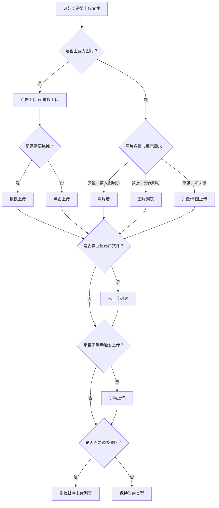

# 1. 简洁易读部份

## 1.0. 组件描述

上传（Upload）是文件选择与上传控件，支持点击选择、拖拽上传、粘贴上传等交互，用于将文件从本地提交到服务器，可展示上传进度与已上传文件列表。

## 1.1. 组件构成

上传由以下基础要素构成，可按需组合使用：

<!-- 附图占位：建议附上一张示例图，展示上传组件的四个基础要素（上传入口、文件列表、进度、操作按钮）的构成关系，标注各要素名称与位置 -->
<!-- [▶ 在线演示](https://infrad.shopee.io/playground/?agent_code_id=111) -->
```react
function App() {
  const { Upload, Button, Progress, Space, Card, Tag, Typography } = Infrad;
  const { UploadOutlined, DeleteOutlined, EyeOutlined } = Icons;
  const { Text } = Typography;
  const fl = [{ uid: '1', name: '采购合同.pdf', status: 'uploading', percent: 52 }];
  return (
    <Card size="small" style={{ maxWidth: 560 }}>
      <Space direction="vertical" size={12} style={{ width: '100%' }}>
        <div><Tag color="processing">上传入口</Tag><Text type="secondary"> </Text><Upload action="/" beforeUpload={() => false} showUploadList={false}><Button icon={<UploadOutlined />}>点击选择文件</Button></Upload></div>
        <div><Tag color="processing">文件列表</Tag><Text type="secondary"> 文件名与状态</Text></div>
        <Upload action="/" listType="text" fileList={fl} beforeUpload={() => false} onChange={() => {}} />
        <div><Tag color="processing">进度</Tag><Progress percent={52} size="small" style={{ maxWidth: 360 }} /></div>
        <div><Tag color="processing">操作按钮</Tag><Space><Button type="link" size="small" icon={<EyeOutlined />}>预览</Button><Button type="link" size="small" icon={<DeleteOutlined />}>删除</Button></Space></div>
      </Space>
    </Card>
  );
}
```

&emsp;&emsp;1. **上传入口** 用于触发文件选择，可为按钮、拖拽区或自定义区域。

&emsp;&emsp;2. **文件列表** 展示已选或已上传的文件，含文件名、状态、操作等。

&emsp;&emsp;3. **进度** 用于展示上传中的进度条，体现上传状态与完成程度。

&emsp;&emsp;4. **操作按钮** 如预览、下载、删除等，用于对已上传文件进行管理。

---

## 1.2. 组件包含哪些不同类型

### 1.2.1 点击上传

&emsp;**是什么**：用户点击按钮或区域打开文件选择框，选择后自动或手动触发上传

<!-- 附图占位：建议附上一张示例图，展示点击上传（上传按钮 + 文件列表）的视觉形态 -->
<!-- [▶ 在线演示](https://infrad.shopee.io/playground/?agent_code_id=112) -->
```react
function App() {
  const { Upload, Button } = Infrad;
  const { UploadOutlined } = Icons;
  const fl = [{ uid: '1', name: '发票扫描件.pdf', status: 'done' }];
  return (
    <Upload action="/" fileList={fl} beforeUpload={() => false} onChange={() => {}}>
      <Button icon={<UploadOutlined />}>上传附件</Button>
    </Upload>
  );
}
```

&emsp;**简单用法**：必须用于最基础的文件上传场景；按钮或区域需明确提示「上传」或「选择文件」；选择后可自动上传或等待用户确认

&emsp;**典型场景**：表单中的文件附件、文档上传、通用文件提交

<!-- 附图占位：建议附上一张场景图，展示表单底部「点击上传」按钮与已选文件列表的典型布局 -->
<!-- [▶ 在线演示](https://infrad.shopee.io/playground/?agent_code_id=113) -->
```react
function App() {
  const { Upload, Button, Form, Input, Card } = Infrad;
  const { UploadOutlined } = Icons;
  const fl = [{ uid: '1', name: '营业执照.jpg', status: 'done' }];
  return (
    <Card title="企业认证" size="small" style={{ maxWidth: 480 }}>
      <Form layout="vertical">
        <Form.Item label="公司名称" name="n"><Input placeholder="请输入公司名称" /></Form.Item>
        <Form.Item label="附件">
          <Upload action="/" fileList={fl} beforeUpload={() => false} onChange={() => {}}>
            <Button icon={<UploadOutlined />}>点击上传</Button>
          </Upload>
        </Form.Item>
      </Form>
    </Card>
  );
}
```

&emsp;**替代方案**：若需拖拽交互，改用拖拽上传；若为图片且需预览，用图片列表或照片墙

### 1.2.2 拖拽上传

&emsp;**是什么**：提供拖拽区域，用户将文件拖入区域即可触发选择与上传，同时支持点击选择

<!-- 附图占位：建议附上一张示例图，展示拖拽上传区域（虚线边框、上传图标、提示文案）的视觉形态 -->
<!-- [▶ 在线演示](https://infrad.shopee.io/playground/?agent_code_id=114) -->
```react
function App() {
  const { Upload } = Infrad;
  const { InboxOutlined } = Icons;
  return (
    <Upload.Dragger action="/" beforeUpload={() => false} multiple style={{ maxWidth: 480 }}>
      <p className="ant-upload-drag-icon"><InboxOutlined style={{ fontSize: 48, color: '#2673dd' }} /></p>
      <p className="ant-upload-text">将文件拖到此处，或点击上传</p>
      <p className="ant-upload-hint">支持 PDF、Word，单个文件不超过 20MB</p>
    </Upload.Dragger>
  );
}
```

&emsp;**简单用法**：必须用于希望提升大文件或批量上传效率的场景；拖拽区需有明确的边界与悬停反馈；须提示支持的格式、大小、数量

&emsp;**典型场景**：批量文件上传、大文件上传、文档中心、资源库

<!-- 附图占位：建议附上一张场景图，展示拖拽区「将文件拖到此处，或点击上传」的布局与拖入时的视觉反馈 -->
<!-- [▶ 在线演示](https://infrad.shopee.io/playground/?agent_code_id=115) -->
```react
function App() {
  const { Upload, Space, Typography } = Infrad;
  const { InboxOutlined } = Icons;
  const { Text } = Typography;
  const [hover, setHover] = React.useState(false);
  const [drag, setDrag] = React.useState(false);
  return (
    <Space size={24} wrap>
      <div onMouseEnter={() => setHover(true)} onMouseLeave={() => setHover(false)}>
        <Upload.Dragger action="/" beforeUpload={() => false} style={{ maxWidth: 220, background: hover ? '#f0f7ff' : undefined, borderColor: hover ? '#2673dd' : undefined }}>
          <InboxOutlined style={{ fontSize: 36, color: '#2673dd' }} />
          <p style={{ margin: '8px 0 0' }}>悬停高亮</p>
        </Upload.Dragger>
        <Text type="secondary" style={{ display: 'block', marginTop: 8 }}>悬停反馈</Text>
      </div>
      <div onDragEnter={() => setDrag(true)} onDragLeave={() => setDrag(false)}>
        <Upload.Dragger action="/" beforeUpload={() => false} style={{ maxWidth: 220, background: drag ? '#e6f4ff' : undefined, borderStyle: 'dashed', borderColor: drag ? '#0958d9' : '#d9d9d9', borderWidth: drag ? 2 : 1 }}>
          <InboxOutlined style={{ fontSize: 36, color: '#0958d9' }} />
          <p style={{ margin: '8px 0 0' }}>拖入此区域</p>
        </Upload.Dragger>
        <Text type="secondary" style={{ display: 'block', marginTop: 8 }}>拖入时加深（示意）</Text>
      </div>
    </Space>
  );
}
```

&emsp;**替代方案**：若用户更习惯点击，用点击上传；若主要为图片，可结合图片墙

### 1.2.3 图片列表

&emsp;**是什么**：文件列表以图片缩略图形式展示，每项含缩略图、文件名、操作，适用于图片上传

<!-- 附图占位：建议附上一张示例图，展示图片列表样式（每行一张缩略图 + 文件名 + 操作图标）的形态 -->
<!-- [▶ 在线演示](https://infrad.shopee.io/playground/?agent_code_id=116) -->
```react
function App() {
  const { Upload } = Infrad;
  const { PlusOutlined } = Icons;
  const fl = [
    { uid: '1', name: '主图.jpg', status: 'done', url: 'https://zos.alipayobjects.com/rmsportal/jkjgkEfvpUPVyRjUImniVslZfWPnJuuZ.png' },
    { uid: '2', name: '细节图.jpg', status: 'done', url: 'https://alicdn.antgroup.com/img/imgextra/i3/O1CN01CvT8Ey1X3JzKpQnYp_!!6000000002878-2-tps-200-200.png' },
  ];
  return (
    <Upload action="/" listType="picture" fileList={fl} beforeUpload={() => false} onChange={() => {}} onPreview={() => {}}>
      <button type="button" style={{ border: 0, background: 'none' }}><PlusOutlined /> 添加图片</button>
    </Upload>
  );
}
```

&emsp;**简单用法**：必须用于上传文件主要为图片的场景；缩略图需清晰可辨；支持预览、删除等操作

&emsp;**典型场景**：商品图上传、相册、证件照、头像（单图时配合裁剪）

<!-- 附图占位：建议附上一张场景图，展示商品编辑中多张商品图的列表样式上传，体现图片缩略图展示 -->
<!-- [▶ 在线演示](https://infrad.shopee.io/playground/?agent_code_id=117) -->
```react
function App() {
  const { Upload, Form, Input, InputNumber, Card } = Infrad;
  const { PlusOutlined } = Icons;
  const fl = [
    { uid: '1', name: 'SKU主图.png', status: 'done', url: 'https://zos.alipayobjects.com/rmsportal/jkjgkEfvpUPVyRjUImniVslZfWPnJuuZ.png' },
    { uid: '2', name: '白底图.png', status: 'done', url: 'https://alicdn.antgroup.com/img/imgextra/i3/O1CN01CvT8Ey1X3JzKpQnYp_!!6000000002878-2-tps-200-200.png' },
    { uid: '3', name: '场景图.png', status: 'done', url: 'https://zos.alipayobjects.com/rmsportal/jkjgkEfvpUPVyRjUImniVslZfWPnJuuZ.png' },
  ];
  return (
    <Card title="商品图片" size="small" style={{ maxWidth: 520 }}>
      <Form layout="vertical">
        <Form.Item label="商品名称"><Input defaultValue="无线蓝牙耳机 Pro" /></Form.Item>
        <Form.Item label="价格"><InputNumber min={0} defaultValue={199} style={{ width: '100%' }} /></Form.Item>
        <Form.Item label="商品图（列表缩略图）">
          <Upload action="/" listType="picture" fileList={fl} beforeUpload={() => false} onChange={() => {}}>
            <button type="button" style={{ border: 0, background: 'none' }}><PlusOutlined /> 上传图片</button>
          </Upload>
        </Form.Item>
      </Form>
    </Card>
  );
}
```

&emsp;**替代方案**：若非图片为主，用默认文本列表；若需卡片式大图展示，用照片墙

### 1.2.4 照片墙

&emsp;**是什么**：以卡片式布局展示图片，每张图占据较大区域，上传入口通常为「+」卡片，适合图片为主、需突出预览的场景

<!-- 附图占位：建议附上一张示例图，展示照片墙（卡片网格、每格一张大图、末尾为上传卡片）的形态 -->
<!-- [▶ 在线演示](https://infrad.shopee.io/playground/?agent_code_id=118) -->
```react
function App() {
  const { Upload } = Infrad;
  const { PlusOutlined } = Icons;
  const fl = [
    { uid: '1', name: '封面.png', status: 'done', url: 'https://zos.alipayobjects.com/rmsportal/jkjgkEfvpUPVyRjUImniVslZfWPnJuuZ.png' },
    { uid: '2', name: '内页1.png', status: 'done', url: 'https://alicdn.antgroup.com/img/imgextra/i3/O1CN01CvT8Ey1X3JzKpQnYp_!!6000000002878-2-tps-200-200.png' },
  ];
  return (
    <Upload action="/" listType="picture-card" fileList={fl} beforeUpload={() => false} onChange={() => {}}>
      <div style={{ marginTop: 8 }}><PlusOutlined /><div style={{ marginTop: 8 }}>上传</div></div>
    </Upload>
  );
}
```

&emsp;**简单用法**：必须用于图片数量可控、需突出每张图预览的场景；上传按钮为「+」或类似卡片；达到 maxCount 后上传入口隐藏

&emsp;**典型场景**：相册上传、作品集、轮播图管理、多图展示

<!-- 附图占位：建议附上一张场景图，展示相册或作品上传的照片墙布局，体现卡片式大图展示与「+」上传入口 -->
<!-- [▶ 在线演示](https://infrad.shopee.io/playground/?agent_code_id=119) -->
```react
function App() {
  const { Upload, Typography, Card } = Infrad;
  const { PlusOutlined } = Icons;
  const { Title } = Typography;
  const fl = [
    { uid: '1', name: '展览现场.jpg', status: 'done', url: 'https://zos.alipayobjects.com/rmsportal/jkjgkEfvpUPVyRjUImniVslZfWPnJuuZ.png' },
    { uid: '2', name: '作品特写.jpg', status: 'done', url: 'https://alicdn.antgroup.com/img/imgextra/i3/O1CN01CvT8Ey1X3JzKpQnYp_!!6000000002878-2-tps-200-200.png' },
  ];
  return (
    <Card size="small" style={{ maxWidth: 520 }}>
      <Title level={5} style={{ marginTop: 0 }}>个人作品集</Title>
      <Upload action="/" listType="picture-card" fileList={fl} beforeUpload={() => false} onChange={() => {}}>
        <div style={{ marginTop: 8 }}><PlusOutlined /><div style={{ marginTop: 8 }}>添加作品</div></div>
      </Upload>
    </Card>
  );
}
```

&emsp;**替代方案**：若空间有限或图片较多，用图片列表；若为单图，可用头像上传

### 1.2.5 已上传列表

&emsp;**是什么**：通过 defaultFileList 或 fileList 展示已有上传记录，支持预览、下载、删除，用于编辑时回显已传文件

<!-- 附图占位：建议附上一张示例图，展示已上传列表（含链接、下载、删除）的形态 -->
<!-- [▶ 在线演示](https://infrad.shopee.io/playground/?agent_code_id=120) -->
```react
function App() {
  const { Upload } = Infrad;
  const fl = [
    { uid: '1', name: '验收单.pdf', status: 'done', url: 'https://zos.alipayobjects.com/rmsportal/jkjgkEfvpUPVyRjUImniVslZfWPnJuuZ.png', linkProps: { download: '验收单.pdf' } },
  ];
  return (
    <Upload action="/" fileList={fl} beforeUpload={() => false} onChange={() => {}} showUploadList={{ showDownloadIcon: true, showRemoveIcon: true }}>
      <span />
    </Upload>
  );
}
```

&emsp;**简单用法**：必须用于编辑已有数据、需回显历史文件的场景；列表项需包含下载链接（若有）；删除需与业务逻辑同步

&emsp;**典型场景**：编辑表单中的附件回显、已上传资源管理、文件替换

<!-- 附图占位：建议附上一张场景图，展示编辑工单时已上传附件的回显列表，体现历史文件的展示与管理 -->
<!-- [▶ 在线演示](https://infrad.shopee.io/playground/?agent_code_id=121) -->
```react
function App() {
  const { Upload, Card, Typography, Tag } = Infrad;
  const { Text } = Typography;
  const fl = [
    { uid: '1', name: '问题截图.png', status: 'done', url: 'https://zos.alipayobjects.com/rmsportal/jkjgkEfvpUPVyRjUImniVslZfWPnJuuZ.png' },
    { uid: '2', name: '日志导出.zip', status: 'done', url: '#' },
  ];
  return (
    <Card size="small" title={<span>工单 #WO-2026040712 <Tag color="blue">处理中</Tag></span>} style={{ maxWidth: 480 }}>
      <Text type="secondary">历史附件（可预览、下载、删除）</Text>
      <div style={{ marginTop: 12 }}>
        <Upload action="/" fileList={fl} beforeUpload={() => false} onChange={() => {}} showUploadList={{ showDownloadIcon: true, showRemoveIcon: true }}>
          <span />
        </Upload>
      </div>
    </Card>
  );
}
```

&emsp;**替代方案**：若为新建、无历史文件，用基础上传即可

### 1.2.6 拖拽排序上传列表

&emsp;**是什么**：已上传文件列表支持拖拽调整顺序，适用于顺序有意义的场景（如轮播图、图集）

<!-- 附图占位：建议附上一张示例图，展示可拖拽排序的文件列表，含拖拽手柄或悬停提示 -->
<!-- [▶ 在线演示](https://infrad.shopee.io/playground/?agent_code_id=122) -->
```react
function App() {
  const { Upload, Space, Typography } = Infrad;
  const { HolderOutlined } = Icons;
  const { Text } = Typography;
  const fl = [
    { uid: '1', name: 'banner_01.png', status: 'done' },
    { uid: '2', name: 'banner_02.png', status: 'done' },
    { uid: '3', name: 'banner_03.png', status: 'done' },
  ];
  return (
    <div style={{ maxWidth: 420 }}>
      <Text type="secondary" style={{ display: 'block', marginBottom: 8 }}>拖动左侧手柄调整顺序（示意）</Text>
      <Upload action="/" listType="text" fileList={fl} beforeUpload={() => false} onChange={() => {}} itemRender={(origin, file, fileList, actions) => (
        <div style={{ display: 'flex', alignItems: 'center', gap: 8, padding: '4px 0' }}>
          <HolderOutlined style={{ color: '#8c8c8c', cursor: 'grab' }} />
          {origin}
        </div>
      )}>
        <span />
      </Upload>
    </div>
  );
}
```

&emsp;**简单用法**：必须用于文件顺序影响展示或业务的场景；通过 itemRender 等扩展实现拖拽；须有明确的排序反馈

&emsp;**典型场景**：轮播图顺序、图集排序、多图展示顺序

<!-- 附图占位：建议附上一张场景图，展示轮播图管理中拖拽调整图片顺序的交互 -->
<!-- [▶ 在线演示](https://infrad.shopee.io/playground/?agent_code_id=123) -->
```react
function App() {
  const { Upload, Card, Typography, Tag } = Infrad;
  const { HolderOutlined } = Icons;
  const { Text } = Typography;
  const fl = [
    { uid: '1', name: '首页轮播_春.png', status: 'done', url: 'https://zos.alipayobjects.com/rmsportal/jkjgkEfvpUPVyRjUImniVslZfWPnJuuZ.png' },
    { uid: '2', name: '首页轮播_夏.png', status: 'done', url: 'https://alicdn.antgroup.com/img/imgextra/i3/O1CN01CvT8Ey1X3JzKpQnYp_!!6000000002878-2-tps-200-200.png' },
  ];
  return (
    <Card size="small" title="首页轮播图顺序" extra={<Tag>拖拽排序</Tag>} style={{ maxWidth: 480 }}>
      <Text type="secondary">调整图片将同步更新前台展示顺序</Text>
      <div style={{ marginTop: 12 }}>
        <Upload action="/" listType="picture" fileList={fl} beforeUpload={() => false} onChange={() => {}} itemRender={(origin) => (
          <div style={{ display: 'flex', alignItems: 'center', gap: 8, marginBottom: 8 }}>
            <HolderOutlined style={{ color: '#8c8c8c' }} />
            {origin}
          </div>
        )}>
          <span />
        </Upload>
      </div>
    </Card>
  );
}
```

&emsp;**替代方案**：若顺序无意义，用默认列表即可

### 1.2.7 手动上传

&emsp;**是什么**：选择文件后不自动上传，需用户点击「开始上传」等按钮才触发上传，适用于需先选后传、或需确认的场景

<!-- 附图占位：建议附上一张示例图，展示手动上传（选择文件 + 开始上传按钮）的形态 -->
<!-- [▶ 在线演示](https://infrad.shopee.io/playground/?agent_code_id=124) -->
```react
function App() {
  const { Upload, Button, Space } = Infrad;
  const { UploadOutlined, CloudUploadOutlined } = Icons;
  const [fl, setFl] = React.useState([]);
  return (
    <Space direction="vertical" style={{ width: '100%' }}>
      <Upload action="/" fileList={fl} beforeUpload={() => false} onChange={({ fileList }) => setFl(fileList)}>
        <Button icon={<UploadOutlined />}>选择文件</Button>
      </Upload>
      <Button type="primary" icon={<CloudUploadOutlined />} disabled={!fl.length}>开始上传</Button>
    </Space>
  );
}
```

&emsp;**简单用法**：必须用于需要用户确认后再上传的场景；beforeUpload 返回 false 可阻止自动上传；需提供明确的上传触发入口

&emsp;**典型场景**：需先审核文件再上传、批量选择后统一上传、需要附加信息后上传

<!-- 附图占位：建议附上一张场景图，展示「选择文件」与「开始上传」分离的流程，体现用户主动触发上传 -->
<!-- [▶ 在线演示](https://infrad.shopee.io/playground/?agent_code_id=125) -->
```react
function App() {
  const { Upload, Button, Space, Steps, Card } = Infrad;
  const { UploadOutlined, CloudUploadOutlined } = Icons;
  const [fl, setFl] = React.useState([{ uid: '1', name: '数据包.zip', status: 'done' }]);
  return (
    <Card size="small" style={{ maxWidth: 520 }}>
      <Steps current={1} items={[{ title: '选择文件' }, { title: '核对信息' }, { title: '开始上传' }]} style={{ marginBottom: 16 }} />
      <Space direction="vertical">
        <Upload action="/" fileList={fl} beforeUpload={() => false} onChange={({ fileList }) => setFl(fileList)}>
          <Button icon={<UploadOutlined />}>继续添加文件</Button>
        </Upload>
        <Button type="primary" icon={<CloudUploadOutlined />}>开始上传</Button>
      </Space>
    </Card>
  );
}
```

&emsp;**替代方案**：若选完即传即可，用默认自动上传

---

## 1.3. 各类型典型场景案例

### 1.3.1 点击与拖拽

<!-- 附图占位：建议附上一张对比图，左侧展示常规表单用点击上传，右侧展示批量/大文件用拖拽上传 -->
<!-- [▶ 在线演示](https://infrad.shopee.io/playground/?agent_code_id=126) -->
```react
function App() {
  const { Upload, Button, Space, Divider, Typography } = Infrad;
  const { UploadOutlined, InboxOutlined } = Icons;
  const { Title } = Typography;
  const flA = [{ uid: 'a1', name: '授权书.pdf', status: 'done' }];
  const flB = [{ uid: 'b1', name: '批量导入_01.xlsx', status: 'done' }, { uid: 'b2', name: '批量导入_02.xlsx', status: 'done' }];
  return (
    <Space size={24} align="start" wrap>
      <div style={{ width: 280 }}>
        <Title level={5}>常规表单 · 点击上传</Title>
        <Upload action="/" fileList={flA} beforeUpload={() => false} onChange={() => {}}>
          <Button icon={<UploadOutlined />}>上传附件</Button>
        </Upload>
      </div>
      <Divider type="vertical" style={{ height: 120 }} />
      <div style={{ width: 300 }}>
        <Title level={5}>批量 / 大文件 · 拖拽上传</Title>
        <Upload.Dragger action="/" fileList={flB} beforeUpload={() => false} onChange={() => {}} style={{ padding: 16 }}>
          <InboxOutlined style={{ fontSize: 32, color: '#2673dd' }} />
          <p style={{ margin: '8px 0 0' }}>拖拽多个文件到此处</p>
        </Upload.Dragger>
      </div>
    </Space>
  );
}
```

✅ **推荐：** 常规单文件或少量文件用点击上传；批量或大文件优先考虑拖拽上传提升效率

<hr>

❌ **不推荐：** 批量上传场景只提供点击、无拖拽；或简单单文件却强行用大拖拽区占空间

### 1.3.2 图片与普通文件

<!-- 附图占位：建议附上一张对比图，左侧展示图片用图片列表/照片墙，右侧展示普通文件用文本列表 -->
<!-- [▶ 在线演示](https://infrad.shopee.io/playground/?agent_code_id=127) -->
```react
function App() {
  const { Upload, Space, Divider, Typography } = Infrad;
  const { PlusOutlined } = Icons;
  const { Title } = Typography;
  const flImg = [{ uid: '1', name: '示意图.png', status: 'done', url: 'https://zos.alipayobjects.com/rmsportal/jkjgkEfvpUPVyRjUImniVslZfWPnJuuZ.png' }];
  const flDoc = [{ uid: '2', name: '技术方案.docx', status: 'done' }];
  return (
    <Space size={24} align="start" wrap>
      <div style={{ width: 280 }}>
        <Title level={5}>图片 · 缩略图列表</Title>
        <Upload action="/" listType="picture" fileList={flImg} beforeUpload={() => false} onChange={() => {}}>
          <button type="button" style={{ border: 0, background: 'none' }}><PlusOutlined /></button>
        </Upload>
      </div>
      <Divider type="vertical" style={{ height: 140 }} />
      <div style={{ width: 280 }}>
        <Title level={5}>普通文件 · 文本列表</Title>
        <Upload action="/" listType="text" fileList={flDoc} beforeUpload={() => false} onChange={() => {}}>
          <button type="button" style={{ border: 0, background: 'none' }}><PlusOutlined /></button>
        </Upload>
      </div>
    </Space>
  );
}
```

✅ **推荐：** 图片为主用图片列表或照片墙；普通文件用默认文本列表

<hr>

❌ **不推荐：** 图片上传用纯文本列表无预览；或普通文档用照片墙浪费空间

### 1.3.3 数量与限制

<!-- 附图占位：建议附上一张对比图，左侧展示有数量上限时明确提示并达到后隐藏上传入口，右侧展示无限制提示导致用户困惑 -->
<!-- [▶ 在线演示](https://infrad.shopee.io/playground/?agent_code_id=128) -->
```react
function App() {
  const { Upload, Space, Typography, Alert } = Infrad;
  const { UploadOutlined } = Icons;
  const { Title } = Typography;
  const flOk = [{ uid: '1', name: '已传图1.jpg', status: 'done', url: 'https://zos.alipayobjects.com/rmsportal/jkjgkEfvpUPVyRjUImniVslZfWPnJuuZ.png' }];
  return (
    <Space size={32} align="start" wrap>
      <div style={{ width: 300 }}>
        <Title level={5}>有上限（最多 3 张）</Title>
        <Alert message="还可上传 1 张图片" type="info" showIcon style={{ marginBottom: 8 }} />
        <Upload action="/" listType="picture-card" fileList={flOk} beforeUpload={() => false} onChange={() => {}} maxCount={3}>
          <div><UploadOutlined /><div style={{ marginTop: 8 }}>上传</div></div>
        </Upload>
      </div>
      <div style={{ width: 300 }}>
        <Title level={5}>无明确提示（不推荐）</Title>
        <Upload action="/" listType="picture-card" fileList={flOk} beforeUpload={() => false} onChange={() => {}}>
          <div><UploadOutlined /><div style={{ marginTop: 8 }}>上传</div></div>
        </Upload>
      </div>
    </Space>
  );
}
```

✅ **推荐：** 有数量、大小、格式限制时明确提示；达到上限后隐藏或禁用上传入口

<hr>

❌ **不推荐：** 不提示限制导致用户选完才报错；或超出限制后仍显示上传入口却点击无效

---

# 2. 选型指南

## 2.1 选择流程




---

# 3. 细致专业部份（交互与排版规则）

## 3.1 上传入口的引导

* **文案**：上传区域需有清晰提示，如「点击上传」或「将文件拖到此处」；可补充格式、大小、数量限制。
* **视觉**：拖拽区需有明确边界（如虚线边框）；悬停与拖入时需有视觉反馈（如高亮、背景色变化）。
* **禁用**：禁用时整个上传区域不可点击、不可拖入，且需视觉置灰。

<!-- 附图占位：建议附上一张场景图，展示拖拽区在默认、悬停、拖入、禁用等状态的视觉差异 -->
<!-- [▶ 在线演示](https://infrad.shopee.io/playground/?agent_code_id=129) -->
```react
function App() {
  const { Upload, Space, Typography } = Infrad;
  const { InboxOutlined } = Icons;
  const { Text } = Typography;
  const base = { maxWidth: 200, padding: '16px 12px' };
  return (
    <Space wrap size={12}>
      <div>
        <Upload.Dragger disabled={false} action="/" beforeUpload={() => false} style={{ ...base, borderStyle: 'dashed', borderColor: '#d9d9d9', background: '#fafafa' }}>
          <InboxOutlined style={{ fontSize: 28 }} /><div style={{ marginTop: 6 }}>默认</div>
        </Upload.Dragger>
        <Text type="secondary" style={{ fontSize: 12 }}>默认</Text>
      </div>
      <div>
        <Upload.Dragger disabled={false} action="/" beforeUpload={() => false} style={{ ...base, borderStyle: 'dashed', borderColor: '#2673dd', background: '#f0f7ff' }}>
          <InboxOutlined style={{ fontSize: 28, color: '#2673dd' }} /><div style={{ marginTop: 6 }}>悬停</div>
        </Upload.Dragger>
        <Text type="secondary" style={{ fontSize: 12 }}>悬停高亮</Text>
      </div>
      <div>
        <Upload.Dragger disabled={false} action="/" beforeUpload={() => false} style={{ ...base, borderStyle: 'dashed', borderColor: '#0958d9', background: '#e6f4ff', borderWidth: 2 }}>
          <InboxOutlined style={{ fontSize: 28, color: '#0958d9' }} /><div style={{ marginTop: 6 }}>拖入</div>
        </Upload.Dragger>
        <Text type="secondary" style={{ fontSize: 12 }}>拖入反馈</Text>
      </div>
      <div>
        <Upload.Dragger disabled action="/" beforeUpload={() => false} style={{ ...base, opacity: 0.55 }}>
          <InboxOutlined style={{ fontSize: 28 }} /><div style={{ marginTop: 6 }}>禁用</div>
        </Upload.Dragger>
        <Text type="secondary" style={{ fontSize: 12 }}>禁用置灰</Text>
      </div>
    </Space>
  );
}
```

## 3.2 上传流程与拦截

* **beforeUpload**：可拦截上传，校验格式、大小等；返回 false 或 Promise.reject 可阻止上传；返回 Upload.LIST_IGNORE 可阻止文件进入列表。
* **customRequest**：可完全自定义上传逻辑，如直传 OSS、分片上传等；需正确处理 onProgress、onSuccess、onError。
* **手动上传**：beforeUpload 返回 false 可阻止自动上传，由业务在适当时机调用上传方法。

## 3.3 文件列表的展示与操作

* **状态**：需区分 uploading、done、error、removed 等状态；上传中显示进度，失败显示错误信息。
* **操作**：支持预览、下载、删除；预览与下载可根据文件类型定制；删除可支持二次确认或不可删（如已审批文件）。
* **受控**：使用 fileList 受控时，onChange 需同步更新 fileList；删除、状态变更均需通过 onChange 反映。

## 3.4 格式、大小与数量限制

* **格式**：通过 accept 限制可选格式；需在文案中明确说明，避免用户选错后才发现不支持。
* **大小**：在 beforeUpload 中校验大小，超限时提示并阻止；可提前在文案中说明限制。
* **数量**：通过 maxCount 限制；为 1 时可覆盖式上传（始终用最新替代当前）；达到上限后上传入口可隐藏或禁用。

## 3.5 图片特殊处理

* **缩略图**：图片类型可展示本地或远程缩略图；非图片可自定义 iconRender。
* **预览**：图片支持点击预览；可自定义 previewFile 支持视频等格式。
* **裁剪**：单图场景（如头像）可配合裁剪组件，先裁后传。

## 3.6 无障碍与安全

* **键盘**：上传入口支持 Tab 聚焦、Enter 触发；文件列表中的操作支持键盘访问。
* **安全**：避免在客户端暴露敏感信息；上传地址、凭证等需通过服务端控制；注意 CORS、文件类型校验等安全策略。

---

## 4.0. 常见问题

### 1. beforeUpload 返回 false 和 Upload.LIST_IGNORE 的区别

- **返回 false**：阻止上传，但文件仍会进入列表，状态为 done（若 beforeUpload 为同步）或维持不变；适用于「选完不立刻上传、先做校验或手动上传」等场景。
- **Upload.LIST_IGNORE**：阻止上传且文件不进入列表，用户看不到该文件；适用于「格式不符、直接过滤掉」等场景。

### 2. fileList 受控时 onChange 只触发一次？

- onChange 仅对已在 fileList 中的文件进行状态更新。若某文件被 beforeUpload 拦截未进入列表，后续该文件的状态变更不会触发 onChange。如需受控管理，需确保需要跟踪的文件在 fileList 中。